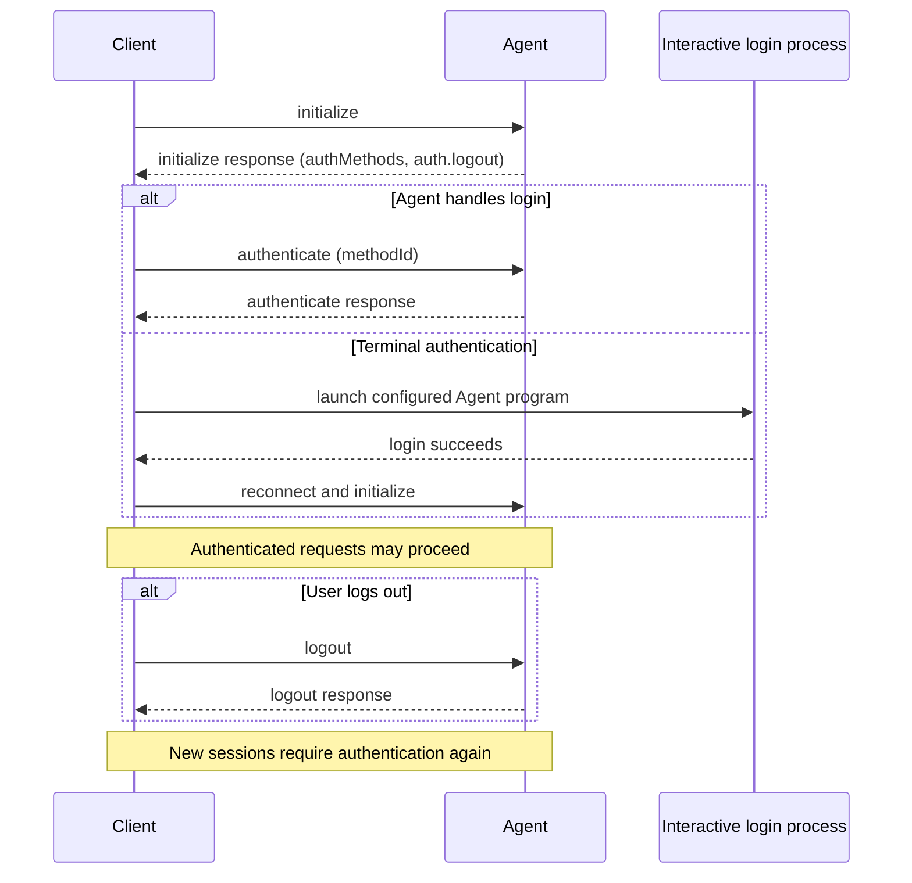

ACP authentication is negotiated during
[initialization](/protocol/v1/initialization). Agents advertise available
authentication methods in `authMethods`. Each authentication method type defines
the flow a Client uses. Agents that support ending an authenticated state
advertise the `logout` capability.

<br />



<br />

## Advertising Authentication

Agents advertise authentication options in the `authMethods` field of the
`initialize` response. Every method has an `id`, but the Client sends that ID to
`authenticate` only for a method whose type defines that protocol-driven flow.

Agents that support `logout` also advertise `agentCapabilities.auth.logout`:

```json highlight={7-11,12-18}
{
  "jsonrpc": "2.0",
  "id": 0,
  "result": {
    "protocolVersion": 1,
    "agentCapabilities": {
      "auth": {
        "logout": {}
      }
    },
    "authMethods": [
      {
        "id": "agent-login",
        "name": "Agent login",
        "description": "Sign in using the agent's login flow"
      }
    ]
  }
}
```

If `agentCapabilities.auth.logout` is omitted or `null`, the Agent does not
support `logout` and Clients **MUST NOT** call it. Supplying `{}` means the Agent
supports the method.

### Authentication method types

The default authentication method type is `agent`, where the Agent handles
authentication itself. When no `type` is present, the method is treated as
`agent`:

```json
{
  "id": "agent-login",
  "name": "Agent login",
  "description": "Sign in using the agent's login flow"
}
```

The `terminal` type tells the Client to run the configured Agent program
interactively:

```json
{
  "id": "terminal-login",
  "name": "Log in from the terminal",
  "type": "terminal",
  "args": ["--login"],
  "env": {
    "ACP_INTERACTIVE_LOGIN": "1"
  }
}
```

Terminal methods require Client support. Clients advertise this during
initialization with `clientCapabilities.auth.terminal`:

```json highlight={7-9}
{
  "jsonrpc": "2.0",
  "id": 0,
  "method": "initialize",
  "params": {
    "protocolVersion": 1,
    "clientCapabilities": {
      "auth": {
        "terminal": true
      }
    }
  }
}
```

A Client advertises this capability only when it can reproduce the configured
Agent invocation in an interactive terminal. An Agent may advertise a
`terminal` method only when this capability is `true`.

See the [schema](/protocol/v1/schema#authmethod) for the full
`AuthMethod` definitions and the [Terminal Authentication
RFD](/rfds/auth-methods) for the design.

## Protocol-driven authentication

When an Agent requires authentication and the selected method uses the
protocol-driven flow, the Client calls `authenticate` with the advertised
authentication method ID:

```json
{
  "jsonrpc": "2.0",
  "id": 1,
  "method": "authenticate",
  "params": {
    "methodId": "agent-login"
  }
}
```

<ParamField path="methodId" type="string" required>
  The ID of an advertised authentication method whose type defines the
  `authenticate` flow. Clients MUST NOT pass a `terminal` method.
</ParamField>

On success, the Agent returns an empty result:

```json
{
  "jsonrpc": "2.0",
  "id": 1,
  "result": {}
}
```

After successful authentication, the Client can create new sessions without
receiving an `auth_required` error for authentication-gated requests.

## Terminal authentication

For a `terminal` method, the Client:

1. Launches a separate interactive process using the same configured Agent
   program and base launch configuration as the ACP connection.
2. Appends the method's `args` and applies its `env`, overriding any same-named
   variables in the base launch configuration.
3. Presents the terminal to the user and waits for the process to exit. Exit
   status zero signals success; a non-zero status, termination without an exit
   status, or cancellation signals failure.
4. Reconnects and reinitializes the ACP Agent.

The descriptor cannot provide a command. The Client derives the command from its
own Agent configuration. Agents **SHOULD** provide arguments that enter a
login-only flow and exit when it completes. ACP does not define an output
pattern or other in-band success signal; Clients may recognize
implementation-specific signals only as an extension. The terminal process is
not the ACP connection, so the Client **MUST NOT** send an `authenticate`
request for a terminal method.

## Logging Out

The `logout` method allows Clients to end the current authenticated state.
Clients should only call it after verifying the Agent advertised
`agentCapabilities.auth.logout` during initialization.

```json
{
  "jsonrpc": "2.0",
  "id": 2,
  "method": "logout",
  "params": {}
}
```

On success, the Agent returns an empty result:

```json
{
  "jsonrpc": "2.0",
  "id": 2,
  "result": {}
}
```

After a successful `logout`, new sessions that require authentication will
require the user to complete one of the advertised authentication flows again.

## Active Sessions

The protocol does not guarantee what happens to already-running sessions after
`logout`. Agents may terminate them, keep them running, or return
`auth_required` errors for future session activity.

Clients **SHOULD** be prepared for active session operations to fail with
authentication-related errors after logout and should prompt the user to
authenticate again when appropriate.
