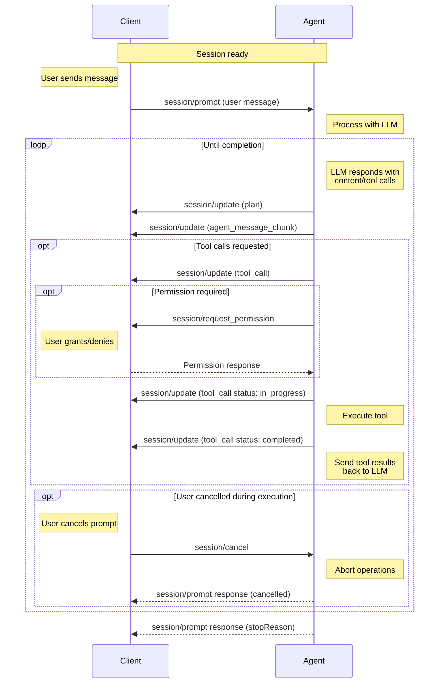

A prompt turn represents a complete interaction cycle between the [Client](/protocol/v1/overview#client) and [Agent](/protocol/v1/overview#agent), starting with a user message and continuing until the Agent completes its response. This may involve multiple exchanges with the language model and tool invocations.

Before sending prompts, Clients **MUST** first complete the [initialization](/protocol/v1/initialization) phase and [session setup](/protocol/v1/session-setup).

## Session Updates

Agents send `session/update` notifications to report streamed content, tool activity, and changes to session state. The `sessionUpdate` field inside `params.update` identifies the variant:

| `sessionUpdate` value       | Description                                                                                                                            |
| --------------------------- | -------------------------------------------------------------------------------------------------------------------------------------- |
| `user_message_chunk`        | A streamed chunk of a user message.                                                                                                    |
| `agent_message_chunk`       | A streamed chunk of the Agent's response.                                                                                              |
| `agent_thought_chunk`       | A streamed chunk of the Agent's reasoning.                                                                                             |
| `tool_call`                 | A new [tool call](/protocol/v1/tool-calls#creating).                                                                                   |
| `tool_call_update`          | A change to a [tool call's status or results](/protocol/v1/tool-calls#updating).                                                       |
| `plan`                      | The Agent's [execution plan](/protocol/v1/agent-plan).                                                                                 |
| `available_commands_update` | The set of [available slash commands](/protocol/v1/slash-commands) is ready or has changed.                                            |
| `current_mode_update`       | The current [session mode](/protocol/v1/session-modes#from-the-agent) has changed.                                                     |
| `config_option_update`      | The session's [configuration options](/protocol/v1/session-config-options#from-the-agent) have changed.                                |
| `session_info_update`       | [Session metadata](/protocol/v1/session-list#updating-session-metadata), such as the title or last update time, has changed.           |
| `usage_update`              | The session's [context window usage and cumulative cost](#session-usage-updates).                                                      |
| `notice`                    | A live [user-facing notice](#session-notices) that is not part of session history. Requires the Client's `session.notices` capability. |
| `compaction_update`         | Creates or updates a [context compaction](#session-compaction). Requires the Client's `session.compaction` capability.                 |
| `compaction_summary_chunk`  | Appends content to a [compaction's retained summary](#session-compaction). Requires the Client's `session.compaction` capability.      |

This is the complete set of variants defined in the current [`SessionUpdate` schema](/protocol/v1/schema#sessionupdate), which describes each payload in detail. The walkthrough below illustrates common uses of these updates.

Session updates are not limited to active prompt turns. For example, Agents may advertise commands after creating a session, and replay user and Agent messages when [loading a session](/protocol/v1/session-setup#loading-sessions).

## The Prompt Turn Lifecycle

A prompt turn follows a structured flow that enables rich interactions between the user, Agent, and any connected tools.

<br />



### 1. User Message

The turn begins when the Client sends a `session/prompt`:

```json
{
  "jsonrpc": "2.0",
  "id": 2,
  "method": "session/prompt",
  "params": {
    "sessionId": "sess_abc123def456",
    "prompt": [
      {
        "type": "text",
        "text": "Can you analyze this code for potential issues?"
      },
      {
        "type": "resource",
        "resource": {
          "uri": "file:///home/user/project/main.py",
          "mimeType": "text/x-python",
          "text": "def process_data(items):\n    for item in items:\n        print(item)"
        }
      }
    ]
  }
}
```

<ParamField path="sessionId" type="SessionId" required>
    The [ID](/protocol/v1/session-setup#session-id) of the session to send this message to.
</ParamField>
<ParamField path="prompt" type="ContentBlock[]" required>
    The contents of the user message, e.g. text, images, files, etc.

    Clients **MUST** restrict types of content according to the [Prompt Capabilities](/protocol/v1/initialization#prompt-capabilities) established during [initialization](/protocol/v1/initialization).

    <Card icon="comments" horizontal href="/protocol/v1/content">
      Learn more about Content
    </Card>

</ParamField>

### 2. Agent Processing

Upon receiving the prompt request, the Agent processes the user's message and sends it to the language model, which **MAY** respond with text content, tool calls, or both.

### 3. Agent Reports Output

The Agent reports the model's output to the Client via `session/update` notifications. This may include the Agent's plan for accomplishing the task:

```json expandable
{
  "jsonrpc": "2.0",
  "method": "session/update",
  "params": {
    "sessionId": "sess_abc123def456",
    "update": {
      "sessionUpdate": "plan",
      "entries": [
        {
          "content": "Check for syntax errors",
          "priority": "high",
          "status": "pending"
        },
        {
          "content": "Identify potential type issues",
          "priority": "medium",
          "status": "pending"
        },
        {
          "content": "Review error handling patterns",
          "priority": "medium",
          "status": "pending"
        },
        {
          "content": "Suggest improvements",
          "priority": "low",
          "status": "pending"
        }
      ]
    }
  }
}
```

<Card icon="lightbulb" horizontal href="/protocol/v1/agent-plan">
  Learn more about Agent Plans
</Card>

The Agent then reports text responses from the model:

```json
{
  "jsonrpc": "2.0",
  "method": "session/update",
  "params": {
    "sessionId": "sess_abc123def456",
    "update": {
      "sessionUpdate": "agent_message_chunk",
      "messageId": "msg_agent_c42b9",
      "content": {
        "type": "text",
        "text": "I'll analyze your code for potential issues. Let me examine it..."
      }
    }
  }
}
```

#### Message IDs

The Agent **MAY** include an opaque, unique `messageId` on message chunks. Chunks with the same `messageId` belong to the same message; a changed `messageId` indicates a new message.

If the model requested tool calls, these are also reported immediately:

```json
{
  "jsonrpc": "2.0",
  "method": "session/update",
  "params": {
    "sessionId": "sess_abc123def456",
    "update": {
      "sessionUpdate": "tool_call",
      "toolCallId": "call_001",
      "title": "Analyzing Python code",
      "kind": "other",
      "status": "pending"
    }
  }
}
```

#### Session Notices

The Agent **MUST NOT** send `notice` updates unless the Client advertised support
by supplying `clientCapabilities.session.notices: {}` in its `initialize`
request. Omitting `session` or `notices`, or setting either field to `null`,
means the Client does not advertise support.

When the capability is absent, the Agent may use an ordinary agent message
instead if the information should still be surfaced to the user. That fallback
is conversation content and follows normal message-history semantics.

When the Client advertises support, the Agent **MAY** send a live user-facing
notice at any point while a session exists, including outside prompt processing:

```json
{
  "jsonrpc": "2.0",
  "method": "session/update",
  "params": {
    "sessionId": "sess_abc123def456",
    "update": {
      "sessionUpdate": "notice",
      "severity": "warning",
      "title": "MCP server unavailable",
      "description": "Continuing without it."
    }
  }
}
```

`severity` is required and non-null and initially supports `info`, `warning`,
and `error`.
It is an open string enum: values beginning with `_` are reserved for
implementation-specific extensions, while other unknown values are reserved
for future ACP severities. Clients preserve unknown values and use a generic
notice presentation without inferring additional behavior from them.

`title` is required, non-null, non-empty plain text suitable for a compact
presentation. `description` is optional, nullable plain text with supporting
detail; omission and `null` both mean no description. `_meta` is an optional,
nullable object scoped to this event; omission and `null` both mean no event
metadata. Unlike compaction patch fields, these fields do not update or clear
an earlier notice.

Advertising support does not acknowledge delivery or guarantee display of an
individual notice. Agents must still behave as though a notice may not have
been received, displayed, or seen. A notice must not carry information required
for protocol correctness, authorization, user action, task completion, or
fatal-error reporting.

Clients own presentation and dismissal. They may use a toast, banner, inline
status region, notification center, or another accessible surface, and may
coalesce repeated notices. Severity is only a presentation hint; even `error`
does not fail a request, stop foreground work, change session state, or imply a
prompt stop reason. Dismissal is local and produces no acknowledgement or
removal event.

Notices have no ID or Agent-managed lifecycle. Each occurrence is an
independent live event, not conversation history, and **SHOULD NOT** be included
in session replay. If a condition remains relevant after reconnecting, the
Agent may emit a new notice.

#### Session Compaction

The Agent **MUST NOT** send `compaction_update` or
`compaction_summary_chunk` unless the Client advertised support by supplying
`clientCapabilities.session.compaction: {}` in its `initialize` request.
Omitting `session` or `compaction`, or setting either field to `null`, means the
Client does not support these updates. This requirement applies to both live
updates and history replay.

When the capability is absent, the Agent may describe compaction through an
ordinary agent message instead. That fallback is conversation content, not an
ID-addressed compaction entity, and follows normal message-history semantics.

When the Client advertises support, the Agent **MAY** report context compaction
as one persistent, ID-addressed timeline entity. A single `compaction_update`
with `status: "completed"` is sufficient; reporting progress is optional.
Summary content is also optional. It may be sent all at once in the `summary`
field or streamed using `compaction_summary_chunk` for the same `compactionId`.

For example, an Agent can report that compaction has started:

```json
{
  "jsonrpc": "2.0",
  "method": "session/update",
  "params": {
    "sessionId": "sess_abc123def456",
    "update": {
      "sessionUpdate": "compaction_update",
      "compactionId": "cmp_001",
      "status": "in_progress"
    }
  }
}
```

`compactionId` and `status` are required and non-null on every
`compaction_update`. The ID is an opaque, Agent-owned string, unique within the
session, and **MUST NOT** be reused for another compaction.

Clients initialize a first-seen compaction ID with status `in_progress` and unset
optional fields, then apply the notification.

The first notification fixes the entity's timeline position in receive
order: it follows previously received timeline content and precedes content
first received later. Later updates and chunks for an ID-addressed entity patch
it in place; they do not move or split it around the compaction.

| `status`      | Meaning                                      |
| ------------- | -------------------------------------------- |
| `in_progress` | Compaction has started and has not finished. |
| `completed`   | Compaction finished successfully.            |
| `failed`      | Compaction finished unsuccessfully.          |
| `cancelled`   | Compaction was cancelled before it finished. |

The Agent **MUST** report a terminal status when a reported compaction ends.

`status` is an open string enum. Values beginning with `_` are reserved for
implementation-specific extensions; other unknown values are reserved for
future ACP statuses. Clients preserve unknown strings and present a generic
state without inferring lifecycle or control behavior.

If the retained summary is available incrementally, the Agent may append one
[content block](/protocol/v1/content) at a time:

```json
{
  "jsonrpc": "2.0",
  "method": "session/update",
  "params": {
    "sessionId": "sess_abc123def456",
    "update": {
      "sessionUpdate": "compaction_summary_chunk",
      "compactionId": "cmp_001",
      "content": {
        "type": "text",
        "text": "## Retained context\n\n"
      }
    }
  }
}
```

`compactionId` and `content` are required and non-null on each chunk.
Chunk `_meta` is optional and nullable, is scoped to that chunk, and has no
patch semantics: omission and `null` both mean no chunk metadata.

An update may omit `summary` to retain the streamed content. A
non-streaming Agent can instead supply the complete summary, and a streaming
Agent can use the same field as an authoritative replacement of content received
so far:

```json
{
  "jsonrpc": "2.0",
  "method": "session/update",
  "params": {
    "sessionId": "sess_abc123def456",
    "update": {
      "sessionUpdate": "compaction_update",
      "compactionId": "cmp_001",
      "status": "completed",
      "summary": [
        {
          "type": "text",
          "text": "## Retained context\n\nThe user is updating the ACP schema."
        }
      ]
    }
  }
}
```

The following `compaction_update` fields are optional, nullable patches:

| Field     | Type             | Meaning                                                                               |
| --------- | ---------------- | ------------------------------------------------------------------------------------- |
| `summary` | `ContentBlock[]` | The unencrypted, user-displayable summary content produced or retained by compaction. |
| `error`   | `string`         | A human-readable error description.                                                   |
| `_meta`   | `object`         | Extensible metadata for the compaction entity.                                        |

For each patch field, omission leaves the stored value unchanged, `null` clears
it, and a concrete value replaces it. On a first-seen ID, omission and `null`
both start with no value. `summary: []` also clears the summary.

Clients apply updates and chunks in receive order for each ID. Chunks append
to the current summary; a concrete `summary` replaces all previously
accumulated content, and any subsequent chunks append to that replacement.
`summary: null` or `summary: []` clears accumulated content, including partial
output before failure or cancellation.

The summary is not the Agent's complete replacement history or generic status
text such as "Compaction completed". It should faithfully represent the
retained, user-displayable summary without internal prompt framing or hidden
instructions. Text blocks may contain Markdown. Agents should omit it when no
unencrypted summary is available or when disclosure would reveal context that
was not otherwise user-visible.

During [history replay](/protocol/v1/session-setup#loading-sessions),
compaction updates and summary chunks follow the same semantics as live delivery.

Replay does not implicitly reset omitted patch fields. Agents use replacement
or clearing summary patches as needed to avoid duplicating content the Client
already holds.

Compaction does not instruct the Client to discard earlier conversation
history; collapsing it is a local presentation choice. It also does not replace
[`usage_update`](#session-usage-updates), which reports current context-window
utilization and cost rather than a compaction boundary.

#### Session Usage Updates

The Agent **MAY** also report current session context and cumulative cost state with a `usage_update`:

```json
{
  "jsonrpc": "2.0",
  "method": "session/update",
  "params": {
    "sessionId": "sess_abc123def456",
    "update": {
      "sessionUpdate": "usage_update",
      "used": 53000,
      "size": 200000,
      "cost": {
        "amount": 0.045,
        "currency": "USD"
      }
    }
  }
}
```

`used` and `size` are required and non-null token counts for the current session context. `cost` is optional and, if present, `amount` and `currency` are required. `currency` is an ISO 4217 currency code like `"USD"`.

### 4. Check for Completion

If there are no pending tool calls, the turn ends and the Agent **MUST** respond to the original `session/prompt` request with a `StopReason`:

```json
{
  "jsonrpc": "2.0",
  "id": 2,
  "result": {
    "stopReason": "end_turn"
  }
}
```

Agents **MAY** stop the turn at any point by returning the corresponding [`StopReason`](#stop-reasons).

### 5. Tool Invocation and Status Reporting

Before proceeding with execution, the Agent **MAY** request permission from the Client via the `session/request_permission` method.

Once permission is granted (if required), the Agent **SHOULD** invoke the tool and report a status update marking the tool as `in_progress`:

```json
{
  "jsonrpc": "2.0",
  "method": "session/update",
  "params": {
    "sessionId": "sess_abc123def456",
    "update": {
      "sessionUpdate": "tool_call_update",
      "toolCallId": "call_001",
      "status": "in_progress"
    }
  }
}
```

As the tool runs, the Agent **MAY** send additional updates, providing real-time feedback about tool execution progress.

While tools execute on the Agent, they **MAY** leverage Client capabilities such as the file system (`fs`) methods to access resources within the Client's environment.

When the tool completes, the Agent sends another update with the final status and any content:

```json
{
  "jsonrpc": "2.0",
  "method": "session/update",
  "params": {
    "sessionId": "sess_abc123def456",
    "update": {
      "sessionUpdate": "tool_call_update",
      "toolCallId": "call_001",
      "status": "completed",
      "content": [
        {
          "type": "content",
          "content": {
            "type": "text",
            "text": "Analysis complete:\n- No syntax errors found\n- Consider adding type hints for better clarity\n- The function could benefit from error handling for empty lists"
          }
        }
      ]
    }
  }
}
```

<Card icon="hammer" horizontal href="/protocol/v1/tool-calls">
  Learn more about Tool Calls
</Card>

### 6. Continue Conversation

The Agent sends the tool results back to the language model as another request.

The cycle returns to [step 2](#2-agent-processing), continuing until the language model completes its response without requesting additional tool calls or the turn gets stopped by the Agent or cancelled by the Client.

## Stop Reasons

When an Agent stops a turn, it must specify the corresponding `StopReason`:

<ResponseField name="end_turn">
  The language model finishes responding without requesting more tools
</ResponseField>

<ResponseField name="max_tokens">
  The maximum token limit is reached
</ResponseField>

<ResponseField name="max_turn_requests">
  The maximum number of model requests in a single turn is exceeded
</ResponseField>

<ResponseField name="refusal">The Agent refuses to continue</ResponseField>

<ResponseField name="cancelled">The Client cancels the turn</ResponseField>

## Cancellation

Clients **MAY** cancel an ongoing prompt turn at any time by sending a `session/cancel` notification:

```json
{
  "jsonrpc": "2.0",
  "method": "session/cancel",
  "params": {
    "sessionId": "sess_abc123def456"
  }
}
```

The Client **SHOULD** preemptively mark all non-finished tool calls pertaining to the current turn as `cancelled` as soon as it sends the `session/cancel` notification.

The Client **MUST** respond to all pending `session/request_permission` requests with the `cancelled` outcome.

When the Agent receives this notification, it **SHOULD** stop all language model requests and all tool call invocations as soon as possible.

After all ongoing operations have been successfully aborted and pending updates have been sent, the Agent **MUST** respond to the original `session/prompt` request with the `cancelled` [stop reason](#stop-reasons).

<Warning>
  API client libraries and tools often throw an exception when their operation is aborted, which may propagate as an error response to `session/prompt`.

Clients often display unrecognized errors from the Agent to the user, which would be undesirable for cancellations as they aren't considered errors.

Agents **MUST** catch these errors and return the semantically meaningful `cancelled` stop reason, so that Clients can reliably confirm the cancellation.

</Warning>

The Agent **MAY** send `session/update` notifications with content or tool call updates after receiving the `session/cancel` notification, but it **MUST** ensure that it does so before responding to the `session/prompt` request.

The Client **SHOULD** still accept tool call updates received after sending `session/cancel`.

---

Once a prompt turn completes, the Client may send another `session/prompt` to continue the conversation, building on the context established in previous turns.
