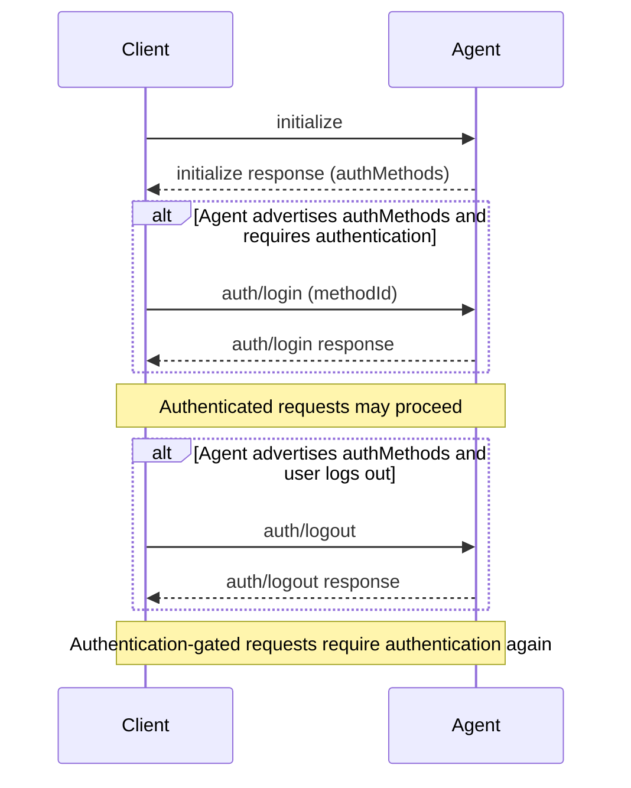

ACP authentication is negotiated during [initialization](/protocol/v2/initialization). Agents advertise available authentication methods in `authMethods`. Clients use `auth/login` and `auth/logout` only when the Agent advertises the authentication surface.

<br />



<br />

## Advertising Authentication

Agents advertise authentication options in the `authMethods` field of the `initialize` response. Each method has a `methodId` that the Client passes back to the Agent in a later `auth/login` request.

Returning one or more valid entries in `authMethods` advertises the authentication surface. An Agent that does so **MUST** implement both `auth/login` and `auth/logout`. If `authMethods` is omitted or empty, the Agent does not advertise this surface and Clients **MUST NOT** call either method.

`capabilities.auth` is orthogonal to this requirement. It advertises authentication-related extensions, not the availability of the baseline `auth/login` and `auth/logout` methods.

```json highlight={8-15}
{
  "jsonrpc": "2.0",
  "id": 0,
  "result": {
    "protocolVersion": 2,
    "capabilities": {},
    "authMethods": [
      {
        "methodId": "agent-login",
        "name": "Agent login",
        "type": "agent",
        "description": "Sign in using the agent's login flow"
      }
    ]
  }
}
```

Because this response contains a valid authentication method, the Agent must support both `auth/login` and `auth/logout`.

### Authentication Method Types

The standard authentication method type is `agent`, where the Agent handles authentication itself. Every authentication method must include a `type` discriminator:

```json
{
  "methodId": "agent-login",
  "name": "Agent login",
  "type": "agent",
  "description": "Sign in using the agent's login flow"
}
```

Authentication method `type` values can be custom or future variants. Custom method types **MUST** begin with `_`. Unknown non-underscore method types are reserved for future ACP variants. Clients that do not understand a method type should preserve the raw method payload when storing, replaying, proxying, or forwarding initialization data, and otherwise ignore the method or display it generically.

See the [schema](/protocol/v2/schema#authmethod) for the full stable `AuthMethod` definition.

## Authenticating

When an Agent has advertised the authentication surface and requires authentication before allowing session creation, the Client calls `auth/login` with one of the advertised authentication method IDs:

```json
{
  "jsonrpc": "2.0",
  "id": 1,
  "method": "auth/login",
  "params": {
    "methodId": "agent-login"
  }
}
```

<ParamField path="methodId" type="string" required>
  The ID of the authentication method to use. This value must match one of the
  methods advertised in the `initialize` response.
</ParamField>

On success, the Agent returns an empty result:

```json
{
  "jsonrpc": "2.0",
  "id": 1,
  "result": {}
}
```

After successful authentication, the Client can create new sessions without receiving an `auth_required` error for authentication-gated requests.

## Logging Out

The `auth/logout` method allows Clients to end the current authenticated state. Clients may call it only when the Agent advertised one or more valid authentication methods during initialization; there is no separate logout capability marker.

```json
{
  "jsonrpc": "2.0",
  "id": 2,
  "method": "auth/logout",
  "params": {}
}
```

On success, the Agent returns an empty result:

```json
{
  "jsonrpc": "2.0",
  "id": 2,
  "result": {}
}
```

After a successful `auth/logout`, new sessions that require authentication will require the Client to call `auth/login` again.

## Active Sessions

The protocol does not guarantee what happens to already-running sessions after `auth/logout`. Agents may terminate them, keep them running, or return `auth_required` errors for future session activity.

Clients **SHOULD** be prepared for active session operations to fail with authentication-related errors after logout and should prompt the user to authenticate again when appropriate.
