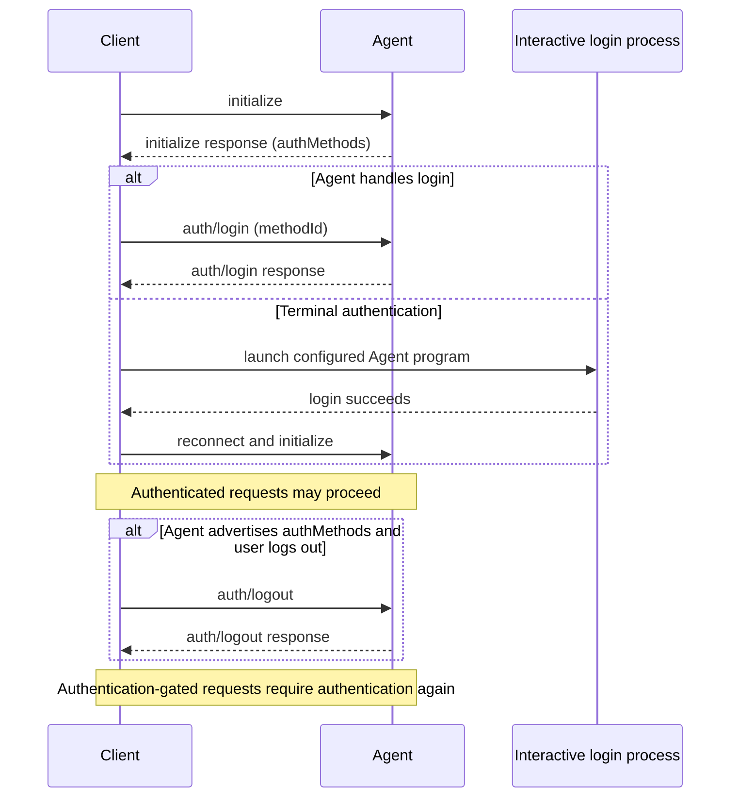

ACP authentication is negotiated during
[initialization](/protocol/v2/initialization). Agents advertise available
authentication methods in `authMethods`. A non-empty list makes `auth/login`
and `auth/logout` available, while each authentication method type defines
whether the Client invokes `auth/login`.

<br />


```mermaid
sequenceDiagram
    participant Client
    participant Agent
    participant Login as Interactive login process

    Client->>Agent: initialize
    Agent-->>Client: initialize response (authMethods)

    alt Agent handles login
        Client->>Agent: auth/login (methodId)
        Agent-->>Client: auth/login response
    else Terminal authentication
        Client->>Login: launch configured Agent program
        Login-->>Client: login succeeds
        Client->>Agent: reconnect and initialize
    end

    Note over Client,Agent: Authenticated requests may proceed

    alt Agent advertises authMethods and user logs out
        Client->>Agent: auth/logout
        Agent-->>Client: auth/logout response
    end

    Note over Client,Agent: Authentication-gated requests require authentication again
```

<br />

## Advertising Authentication

Agents advertise authentication options in the `authMethods` field of the
`initialize` response. Every method has a `methodId`, but the Client sends that
ID to `auth/login` only for a method whose type defines that protocol-driven
flow.

Returning one or more valid entries in `authMethods` advertises the
authentication surface. An Agent that does so **MUST** implement both
`auth/login` and `auth/logout`. If `authMethods` is omitted or empty, the Agent
does not advertise this surface and Clients **MUST NOT** call either method.

`capabilities.auth` is orthogonal to this requirement. It advertises
authentication-related extensions, not the availability of the baseline
`auth/login` and `auth/logout` methods.

```json highlight={8-15}
{
  "jsonrpc": "2.0",
  "id": 0,
  "result": {
    "protocolVersion": 2,
    "capabilities": {},
    "authMethods": [
      {
        "methodId": "agent-login",
        "name": "Agent login",
        "type": "agent",
        "description": "Sign in using the agent's login flow"
      }
    ]
  }
}
```

Because this response contains an `agent` authentication method, the Agent must
support both `auth/login` and `auth/logout`.

### Authentication method types

The standard authentication method type is `agent`, where the Agent handles
authentication through `auth/login`. Every authentication method must include a
`type` discriminator:

```json
{
  "methodId": "agent-login",
  "name": "Agent login",
  "type": "agent",
  "description": "Sign in using the agent's login flow"
}
```

The `terminal` type tells the Client to run the configured Agent program
interactively:

```json
{
  "methodId": "terminal-login",
  "name": "Log in from the terminal",
  "type": "terminal",
  "args": ["--login"],
  "env": [
    {
      "name": "ACP_INTERACTIVE_LOGIN",
      "value": "1"
    }
  ]
}
```

Authentication method `type` values can be custom or future variants. Custom
method types **MUST** begin with `_`. Unknown non-underscore method types are
reserved for future ACP variants. Clients that do not understand a method type
should preserve the raw method payload when storing, replaying, proxying, or
forwarding initialization data, and otherwise ignore the method or display it
generically.

Terminal authentication methods require Client support. Clients advertise this
during initialization with `capabilities.auth.terminal`:

```json highlight={7-9}
{
  "jsonrpc": "2.0",
  "id": 0,
  "method": "initialize",
  "params": {
    "protocolVersion": 2,
    "capabilities": {
      "auth": {
        "terminal": {}
      }
    }
  }
}
```

If `capabilities.auth.terminal` is omitted or `null`, the Client does not
advertise support. Supplying `{}` means the Client can reproduce the configured
Agent invocation in an interactive terminal. An Agent may advertise a
`terminal` method only when this capability is present.

See the [schema](/protocol/v2/schema#authmethod) for the full
`AuthMethod` definitions and the [Terminal Authentication
RFD](/rfds/auth-methods) for the design.

## Agent-handled authentication

When an Agent requires authentication and the selected method's type defines a
protocol-driven login flow, the Client calls `auth/login` with that advertised
method's ID:

```json
{
  "jsonrpc": "2.0",
  "id": 1,
  "method": "auth/login",
  "params": {
    "methodId": "agent-login"
  }
}
```

<ParamField path="methodId" type="string" required>
  The ID of an advertised authentication method whose type defines the
  `auth/login` flow. Clients MUST NOT pass a `terminal` method.
</ParamField>

On success, the Agent returns an empty result:

```json
{
  "jsonrpc": "2.0",
  "id": 1,
  "result": {}
}
```

After successful authentication, the Client can create new sessions without
receiving an `auth_required` error for authentication-gated requests.

## Terminal authentication

For a `terminal` method, the Client:

1. Launches a separate interactive process using the same configured Agent
   program and base launch configuration as the ACP connection.
2. Appends the method's `args` and applies its `env`, overriding any same-named
   variables in the base launch configuration. Every `env` entry **MUST** have a
   unique `name`.
3. Presents the terminal to the user and waits for the process to exit. Exit
   status zero signals success; a non-zero status, termination without an exit
   status, or cancellation signals failure.
4. Reconnects and reinitializes the ACP Agent, then retries the operation that
   required authentication.

The descriptor cannot provide a command. The Client derives the command from its
own Agent configuration. Agents **SHOULD** provide arguments that enter a
login-only flow and exit when it completes. ACP does not define an output
pattern or other in-band success signal; Clients may recognize
implementation-specific signals only as an extension. The terminal process is
not the ACP connection, so the Client **MUST NOT** send an `auth/login` request
for a terminal method.

## Logging Out

The `auth/logout` method allows Clients to end the current authenticated state.
Clients may call it only when the Agent advertised one or more valid
authentication methods during initialization; there is no separate logout
capability marker.

```json
{
  "jsonrpc": "2.0",
  "id": 2,
  "method": "auth/logout",
  "params": {}
}
```

On success, the Agent returns an empty result:

```json
{
  "jsonrpc": "2.0",
  "id": 2,
  "result": {}
}
```

After a successful `auth/logout`, authentication-gated requests will require the
user to complete one of the advertised authentication flows again.

## Active Sessions

The protocol does not guarantee what happens to already-running sessions after
`auth/logout`. Agents may terminate them, keep them running, or return
`auth_required` errors for future session activity.

Clients **SHOULD** be prepared for active session operations to fail with
authentication-related errors after logout and should prompt the user to
authenticate again when appropriate.
