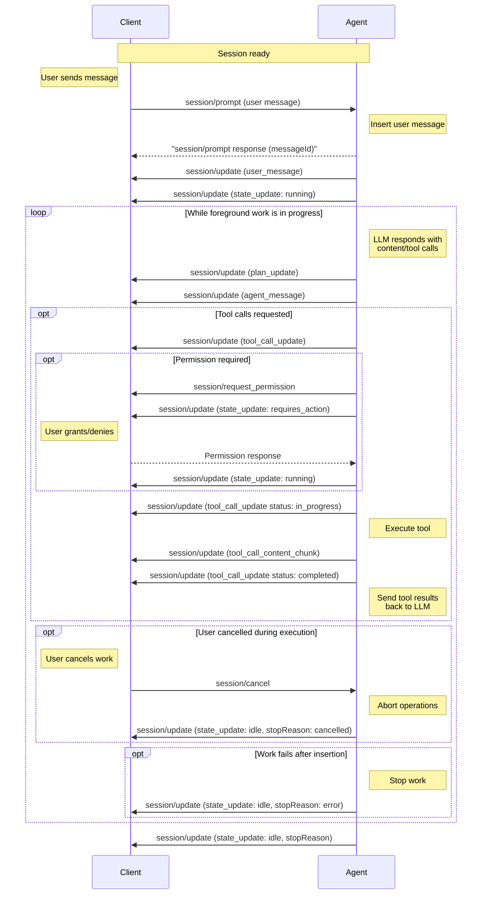

A prompt starts or contributes to foreground work in a session. The [Agent](/protocol/v2/draft/overview#agent) may continue that work until it reports `idle`, including across multiple model exchanges and tool invocations.

`session/prompt` lasts until the Agent inserts the user message into the ACP conversation. This is what acceptance means for a prompt. The response returns that message's `messageId`; the Agent reports its content and placement, foreground state, output, and completion through `session/update` notifications.

Before sending prompts, Clients **MUST** first complete the [initialization](/protocol/v2/draft/initialization) phase and [session setup](/protocol/v2/draft/session-setup).

## Session Updates

Agents send `session/update` notifications to report streamed content, tool activity, and changes to session state. The `sessionUpdate` field inside `params.update` identifies the variant:

| `sessionUpdate` value       | Description                                                                                                                        |
| --------------------------- | ---------------------------------------------------------------------------------------------------------------------------------- |
| `user_message_chunk`        | A streamed chunk of a user message.                                                                                                |
| `user_message`              | Creates or updates a user message identified by `messageId`.                                                                       |
| `agent_message_chunk`       | A streamed chunk of the Agent's response.                                                                                          |
| `agent_message`             | Creates or updates an Agent message identified by `messageId`.                                                                     |
| `agent_thought_chunk`       | A streamed chunk of the Agent's reasoning.                                                                                         |
| `agent_thought`             | Creates or updates an Agent reasoning message identified by `messageId`.                                                           |
| `subagent_update`           | **Draft only.** Announces an owned child session or updates its display metadata, capabilities, and mirrored work-state snapshot.  |
| `session_message`           | **Draft only.** Creates or updates a [message addressed to another session](#session-directed-messages-unstable).                  |
| `session_message_chunk`     | **Draft only.** Appends content to a [session-directed message](#session-directed-messages-unstable).                              |
| `state_update`              | A change to the Agent's [foreground work state](#session-states).                                                                  |
| `tool_call_content_chunk`   | Appends a [content chunk to a tool call](/protocol/v2/draft/tool-calls#streaming-content).                                         |
| `tool_call_update`          | Creates or updates a [tool call](/protocol/v2/draft/tool-calls#reporting).                                                         |
| `terminal_update`           | Creates or updates an [Agent-owned terminal](/protocol/v2/draft/tool-calls#display-only-terminals).                                |
| `terminal_output_chunk`     | Appends output bytes to an [Agent-owned terminal](/protocol/v2/draft/tool-calls#display-only-terminals).                           |
| `plan_update`               | Creates or updates the [content of a plan](/protocol/v2/draft/agent-plan) identified by ID.                                        |
| `plan_removed`              | **Draft only.** [Removal of a plan](/protocol/v2/draft/agent-plan#removing-plans) identified by ID.                                |
| `available_commands_update` | The set of [available slash commands](/protocol/v2/draft/slash-commands) is ready or has changed.                                  |
| `config_option_update`      | The session's [configuration options](/protocol/v2/draft/session-config-options#from-the-agent) have changed.                      |
| `session_info_update`       | [Session metadata](/protocol/v2/draft/session-list#updating-session-metadata), such as the title or last update time, has changed. |
| `usage_update`              | The session's [context window usage and cumulative cost](#session-usage-updates).                                                  |
| `notice`                    | **Draft only.** A live [advisory notice](#session-notices) that is not part of session history.                                    |
| `compaction_update`         | **Draft only.** Creates or updates a [context compaction](#session-compaction).                                                    |
| `compaction_summary_chunk`  | **Draft only.** Appends content to a [compaction's retained summary](#session-compaction).                                         |

This is the complete set of standard variants defined in the current draft [`SessionUpdate` schema](/protocol/v2/draft/schema#sessionupdate), which describes each payload in detail. Draft-only variants are unstable and may change or be removed. The walkthrough below illustrates common uses of these updates.

The protocol also supports [custom and future variants](/protocol/v2/draft/extensibility#enum-and-tagged-union-variants). Clients that do not understand an update should preserve its raw payload when storing, replaying, proxying, or forwarding session history, and otherwise ignore it or display it generically.

Preserving a payload does not make it durable session history. In particular,
live-only [notices](#session-notices) **SHOULD NOT** be replayed, even when a
Client carries them through the unknown-update fallback. They may be forwarded
live or retained for local diagnostics instead.

Session updates are not limited to prompt-driven foreground work. For example, Agents may advertise commands after creating a session, and background activity may emit updates while the Agent is [idle](#session-states).

### Entity IDs

Messages, tool calls, terminals, plans, and compactions are entities that the Agent creates and then updates by ID across multiple session updates. An entity is identified by its type together with its ID, not by its ID alone:

| Entity type                           | Session updates                                 | ID field       |
| ------------------------------------- | ----------------------------------------------- | -------------- |
| User message                          | `user_message`, `user_message_chunk`            | `messageId`    |
| Agent message                         | `agent_message`, `agent_message_chunk`          | `messageId`    |
| Agent thought                         | `agent_thought`, `agent_thought_chunk`          | `messageId`    |
| Session-directed message (draft only) | `session_message`, `session_message_chunk`      | `messageId`    |
| Tool call                             | `tool_call_update`, `tool_call_content_chunk`   | `toolCallId`   |
| Terminal                              | `terminal_update`, `terminal_output_chunk`      | `terminalId`   |
| Plan                                  | `plan_update`, `plan_removed`                   | `planId`       |
| Compaction (draft only)               | `compaction_update`, `compaction_summary_chunk` | `compactionId` |

An ID is unique among entities of the same type within a session, not across all entity types, so the same string can identify one entity of each type. User messages, Agent messages, Agent thoughts, and session-directed messages are separate types even though they share the `messageId` field. For example, an Agent may report a thought and a response derived from the same model output with the same `messageId`; they remain two distinct entities.

The Agent **MUST NOT** reuse an ID for a different entity of the same type within a session. Clients **MUST** key entities by both type and ID. An update applies only to the entity of its own type: an `agent_thought` whose `messageId` matches an existing Agent message creates or updates a thought and leaves the message unchanged. Likewise, a field that references an entity identifies an entity of one specific type; for example, the `messageId` returned by `session/prompt` identifies a user message.

### Session-directed messages (unstable)

The Agent may report outgoing and incoming messages between sessions,
separately from user-facing responses and tool calls. The outer
`params.sessionId` identifies the transcript being updated. Every
`session_message` or `session_message_chunk` requires `messageId`, scoped to
that transcript. Optional `senderSessionId` and `recipientSessionId` metadata
identify the participants. Include them on the first update when available;
later updates may omit them or add missing identities.

For example, an incoming message in the child can begin with a streamed chunk:

```json
{
  "jsonrpc": "2.0",
  "method": "session/update",
  "params": {
    "sessionId": "child_session",
    "update": {
      "sessionUpdate": "session_message_chunk",
      "messageId": "received_message_1",
      "senderSessionId": "parent_session",
      "recipientSessionId": "child_session",
      "content": { "type": "text", "text": "Please investigate " }
    }
  }
}
```

Chunks append normal message content for the same IDs. A `session_message`
upsert may replace the whole `content` array or update message metadata.
Omission leaves either field unchanged; `null` clears it. `content: []` also
clears accumulated content. Chunk `_meta` is scoped to that chunk and does not
patch message metadata.

Clients can render "To …" with a recipient link or "From …" with a sender link.
Without sufficient participant metadata, use a generic inter-session
presentation and add links when the metadata arrives. Omitted or `null`
participant IDs mean not supplied and leave previously known identities intact.
The two views have independent message IDs. The Agent reports each side only
when observed; Clients must not synthesize an incoming entry from an outgoing
one or forward the content themselves. Neither view acknowledges completed
recipient processing.

## Prompt Lifecycle

A typical prompt-driven flow enables rich interactions between the user, Agent, and any connected tools.

<br />



### 1. User Message

The Client sends a user message with `session/prompt`:

```json
{
  "jsonrpc": "2.0",
  "id": 2,
  "method": "session/prompt",
  "params": {
    "sessionId": "sess_abc123def456",
    "prompt": [
      {
        "type": "text",
        "text": "Can you analyze this code for potential issues?"
      },
      {
        "type": "resource",
        "resource": {
          "uri": "file:///home/user/project/main.py",
          "mimeType": "text/x-python",
          "text": "def process_data(items):\n    for item in items:\n        print(item)"
        }
      }
    ]
  }
}
```

<ParamField path="sessionId" type="SessionId">
    The [ID](/protocol/v2/draft/session-setup#session-id) of the session to send this message to.
</ParamField>
<ParamField path="prompt" type="ContentBlock[]">
    The contents of the user message, e.g. text, images, files, etc.

    Clients **MUST** restrict types of content according to the [Prompt Capabilities](/protocol/v2/draft/initialization#session-prompt-capabilities) established during [initialization](/protocol/v2/draft/initialization).

    <Card icon="comments" horizontal href="/protocol/v2/draft/content">
      Learn more about Content
    </Card>

</ParamField>

### 2. Prompt Accepted

**Acceptance means insertion**, not receipt, queueing, or processing completion. The Agent **MUST** respond successfully once it has inserted the user message into the ACP conversation, without waiting for foreground work to finish. It **MUST NOT** send a successful response merely because it has received the input or assigned an ID. Requests rejected before insertion use a JSON-RPC error response. Once the user message is inserted, the Agent **MUST NOT** report a later failure as an error response, even if it has not sent the response yet: it responds successfully and reports the failure as described in [Failures](#failures). This includes [request cancellation](/protocol/v2/draft/cancellation): once the message is inserted, the Agent answers `session/prompt` with its `messageId` rather than a `-32800` error, and foreground work is stopped with [`session/cancel`](#cancellation) or ends with a stop reason.

The response contains the inserted user message's agent-generated `messageId`:

```json
{
  "jsonrpc": "2.0",
  "id": 2,
  "result": {
    "messageId": "msg_user_8f7a1"
  }
}
```

<ResponseField name="messageId" type="MessageId" required>
  The opaque ID of the inserted user message. This field is a required, non-null
  string; omission and explicit `null` are invalid.
</ResponseField>

The Agent **MUST** also report the inserted user message through a `user_message` update with the full `content` array or streamed `user_message_chunk` updates. All updates for that message **MUST** use the returned `messageId`. The response and updates describe the same insertion, but Clients **MUST** tolerate the updates arriving before or after the response.

```json
{
  "jsonrpc": "2.0",
  "method": "session/update",
  "params": {
    "sessionId": "sess_abc123def456",
    "update": {
      "sessionUpdate": "user_message",
      "messageId": "msg_user_8f7a1",
      "content": [
        {
          "type": "text",
          "text": "Can you analyze this code for potential issues?"
        }
      ]
    }
  }
}
```

The Client uses the JSON-RPC response ID to identify its submission, then associates it with `(sessionId, messageId)`. If the message update arrived first, the Client reconciles with that existing message rather than creating a duplicate. Agents **MUST** assign distinct message IDs to distinct inserted submissions, even if their content is identical; Clients must not infer the association from content or arrival order.

Insertion is not a promise of durable storage or model consumption. Every inserted input, including a locally handled command, is reported live, but Agents are not required to persist it or retain it for any minimum period. If the message is retained and replayed, the Agent **MUST** use the same ID. See [Resuming Sessions](/protocol/v2/draft/session-setup#resuming-sessions).

A successful prompt response is not an `idle` signal. Session work and notifications continue independently of the completed prompt request. If the response is lost, the submission's outcome remains uncertain: replay may omit live-only or discarded messages, and a retry can create another submission.

### 3. Agent Reports Output

When foreground work starts or resumes, the Agent **MUST** send a `state_update` notification with `state: "running"`:

```json
{
  "jsonrpc": "2.0",
  "method": "session/update",
  "params": {
    "sessionId": "sess_abc123def456",
    "update": {
      "sessionUpdate": "state_update",
      "state": "running"
    }
  }
}
```

The language model **MAY** respond with text content, tool calls, or both.

The Agent reports the model's output to the Client via `session/update` notifications. This may include the Agent's plan for accomplishing the task:

```json expandable
{
  "jsonrpc": "2.0",
  "method": "session/update",
  "params": {
    "sessionId": "sess_abc123def456",
    "update": {
      "sessionUpdate": "plan_update",
      "plan": {
        "type": "items",
        "planId": "plan-1",
        "entries": [
          {
            "content": "Check for syntax errors",
            "priority": "high",
            "status": "pending"
          },
          {
            "content": "Identify potential type issues",
            "priority": "medium",
            "status": "pending"
          },
          {
            "content": "Review error handling patterns",
            "priority": "medium",
            "status": "pending"
          },
          {
            "content": "Suggest improvements",
            "priority": "low",
            "status": "pending"
          }
        ]
      }
    }
  }
}
```

<Card icon="lightbulb" horizontal href="/protocol/v2/draft/agent-plan">
  Learn more about Agent Plans
</Card>

The Agent can report the model's text response as an `agent_message` update with the full `content` array:

```json
{
  "jsonrpc": "2.0",
  "method": "session/update",
  "params": {
    "sessionId": "sess_abc123def456",
    "update": {
      "sessionUpdate": "agent_message",
      "messageId": "msg_agent_c42b9",
      "content": [
        {
          "type": "text",
          "text": "I'll analyze your code for potential issues. Let me examine it..."
        }
      ]
    }
  }
}
```

The Agent **MUST** include an opaque `messageId` on message updates and message chunks.

User, agent, and thought messages can each be reported either as a message update with a full `content` array or as streamed chunks. `user_message`, `agent_message`, and `agent_thought` updates are upserts keyed by `messageId`: omitted `content` leaves the existing message content unchanged, `content: null` clears it, and concrete `content` arrays replace the previous content. Chunk updates with the same `messageId` append content; a changed `messageId` indicates a new message.

Clients apply message updates and chunks in the order they are received for each `messageId`:

- A message update without `content` leaves the current content unchanged, so Agents can update other optional fields without resending content.
- A message update with `content` replaces all content currently stored for that message, including content accumulated from earlier chunks.
- A message update with `content: []` or `content: null` clears the message content.
- A chunk appends its `content` to whatever content is current for that message, whether that content came from an earlier message update or earlier chunks.
- A chunk's `_meta`, when present, is chunk-scoped.

For example, if an Agent sends `agent_message` with `content: [A]`, then sends `agent_message_chunk` with `B`, the rendered message content is `[A, B]`. If it later sends another `agent_message` with `content: [C]`, the rendered content becomes `[C]`; the earlier full content and chunks are replaced. Subsequent chunks append to `[C]`.

For streaming agent text, the Agent can use `agent_message_chunk` updates:

```json
{
  "jsonrpc": "2.0",
  "method": "session/update",
  "params": {
    "sessionId": "sess_abc123def456",
    "update": {
      "sessionUpdate": "agent_message_chunk",
      "messageId": "msg_agent_c42b9",
      "content": {
        "type": "text",
        "text": " Let me examine it..."
      }
    }
  }
}
```

The Agent can report internal reasoning with the same message-update or chunk patterns. `agent_thought` updates patch fields for the same thought `messageId`; `agent_thought_chunk` updates append new content.

```json
{
  "jsonrpc": "2.0",
  "method": "session/update",
  "params": {
    "sessionId": "sess_abc123def456",
    "update": {
      "sessionUpdate": "agent_thought",
      "messageId": "msg_thought_a12",
      "content": [
        {
          "type": "text",
          "text": "Need to inspect the loop body before suggesting a fix."
        }
      ]
    }
  }
}
```

If the model requested tool calls, these are also reported immediately:

```json
{
  "jsonrpc": "2.0",
  "method": "session/update",
  "params": {
    "sessionId": "sess_abc123def456",
    "update": {
      "sessionUpdate": "tool_call_update",
      "toolCallId": "call_001",
      "title": "Analyzing Python code",
      "kind": "other",
      "status": "pending"
    }
  }
}
```

#### Session Notices

<Note>
  Session notices are a Preview feature and are available only in the draft
  schema. Their wire contract may change before stabilization. See the [Session
  Notices RFD](/rfds/session-notices).
</Note>

No Client capability is required in v2. Clients that do not implement `notice`
may preserve it through the [unknown-update
fallback](/protocol/v2/draft/extensibility#enum-and-tagged-union-variants) and
ignore it or present it generically; this does not give it replay semantics.

At any point while a session exists, including outside prompt processing, the
Agent **MAY** send a live advisory notice:

```json
{
  "jsonrpc": "2.0",
  "method": "session/update",
  "params": {
    "sessionId": "sess_abc123def456",
    "update": {
      "sessionUpdate": "notice",
      "severity": "warning",
      "title": "MCP server unavailable",
      "description": "Continuing without it."
    }
  }
}
```

`severity` is required and non-null and initially supports `info`, `warning`,
and `error`.
It is an open string enum: values beginning with `_` are reserved for
implementation-specific extensions, while other unknown values are reserved
for future ACP severities. Clients preserve unknown values and use a generic
notice presentation without inferring additional behavior from them.

`title` is required, non-null, non-empty plain text suitable for a compact
presentation. `description` is optional, nullable plain text with supporting
detail; omission and `null` both mean no description. `_meta` is an optional,
nullable object scoped to this event; omission and `null` both mean no event
metadata. Unlike compaction patch fields, these fields do not update or clear
an earlier notice.

Clients may ignore them, and Agents must behave as though a
notice may not have been received, displayed, or seen. A notice must not carry
information required for protocol correctness, authorization, user action,
task completion, or fatal-error reporting.

Clients own presentation and dismissal. They may use a toast, banner, inline
status region, notification center, or another accessible surface, and may
coalesce repeated notices. Severity is only a presentation hint; even `error`
does not fail a request, stop foreground work, change session state, or imply a
prompt stop reason. Dismissal is local and produces no acknowledgement or
removal event.

Notices have no ID or Agent-managed lifecycle. Each occurrence is an
independent live event, not conversation history, and **SHOULD NOT** be included
in session replay. If a condition remains relevant after reconnecting, the
Agent may emit a new notice.

#### Session Compaction

<Note>
  Session compaction is a Preview feature and is available only in the draft
  schema. Its wire contract may change before stabilization. See the [Session
  Compaction RFD](/rfds/session-compaction).
</Note>

No Client capability is required in v2.

The Agent **MAY** report context compaction as one persistent, ID-addressed timeline
entity. It first sends `compaction_update` and may then append retained summary
content with `compaction_summary_chunk` before sending one terminal update for
the same `compactionId`:

```json
{
  "jsonrpc": "2.0",
  "method": "session/update",
  "params": {
    "sessionId": "sess_abc123def456",
    "update": {
      "sessionUpdate": "compaction_update",
      "compactionId": "cmp_001",
      "status": "in_progress"
    }
  }
}
```

`compactionId` and `status` are required and non-null on every
`compaction_update`. The ID is an opaque, Agent-owned string, unique within the
session, and **MUST NOT** be reused for another compaction.

The first update fixes the entity's timeline position relative to other
ID-addressed entities: it follows entities first seen earlier and precedes
entities first seen later. Later updates and chunks patch the same entity in
place; they do not move it or split another entity around it.

| `status`      | Meaning                                      |
| ------------- | -------------------------------------------- |
| `in_progress` | Compaction has started and has not finished. |
| `completed`   | Compaction finished successfully.            |
| `failed`      | Compaction finished unsuccessfully.          |
| `cancelled`   | Compaction was cancelled before it finished. |

After emitting `in_progress`, the Agent **MUST** eventually send exactly one
terminal status (`completed`, `failed`, or `cancelled`) when the compaction
ends, unless the session or connection ends before delivery. A terminal status
may be the first update during replay or when the runtime exposes only
completed compactions.

`status` is an open string enum. Values beginning with `_` are reserved for
implementation-specific extensions; other unknown values are reserved for
future ACP statuses. Clients preserve unknown strings and present a generic
state without inferring lifecycle or control behavior.

If the retained summary is available incrementally, the Agent may append one
[content block](/protocol/v2/draft/content) at a time:

```json
{
  "jsonrpc": "2.0",
  "method": "session/update",
  "params": {
    "sessionId": "sess_abc123def456",
    "update": {
      "sessionUpdate": "compaction_summary_chunk",
      "compactionId": "cmp_001",
      "content": {
        "type": "text",
        "text": "## Retained context\n\n"
      }
    }
  }
}
```

`compactionId` and `content` are required and non-null on each chunk. Agents
**MUST** send the first `compaction_update` before any chunk for that ID and may
send chunks only after `in_progress` and before a terminal update. Chunk `_meta`
is optional and nullable, is scoped to that chunk, and has no patch semantics:
omission and `null` both mean no chunk metadata.

A completed update may omit `summary` to retain the streamed content. A
non-streaming Agent can instead supply the complete summary, and a streaming
Agent can use the same field as an authoritative final replacement:

```json
{
  "jsonrpc": "2.0",
  "method": "session/update",
  "params": {
    "sessionId": "sess_abc123def456",
    "update": {
      "sessionUpdate": "compaction_update",
      "compactionId": "cmp_001",
      "status": "completed",
      "summary": [
        {
          "type": "text",
          "text": "## Retained context\n\nThe user is updating the ACP schema."
        }
      ]
    }
  }
}
```

The following `compaction_update` fields are optional, nullable patches:

| Field     | Type             | Meaning                                                                                                             |
| --------- | ---------------- | ------------------------------------------------------------------------------------------------------------------- |
| `summary` | `ContentBlock[]` | The unencrypted, user-displayable content retained by compaction. A non-empty array is only valid with `completed`. |
| `error`   | `string`         | A human-readable failure description, only valid with `failed`.                                                     |
| `_meta`   | `object`         | Extensible metadata for the compaction entity.                                                                      |

For each patch field, omission leaves the stored value unchanged, `null` clears
it, and a concrete value replaces it. On a first-seen ID, omission and `null`
both start with no value. `summary: []` also clears the summary.

Clients apply updates and chunks in receive order for each ID. Chunks append
to the current summary; a concrete `summary` replaces all previously
accumulated content, and any subsequent chunks append to that replacement.
`summary: null` or `summary: []` clears accumulated content, including partial
output before failure or cancellation.

The summary is not the Agent's complete replacement history or generic status
text such as "Compaction completed". It should faithfully represent the
retained, user-displayable summary without internal prompt framing or hidden
instructions. Text blocks may contain Markdown. Agents should omit it when no
unencrypted summary is available or when disclosure would reveal context that
was not otherwise user-visible.

During [history replay](/protocol/v2/draft/session-setup#resuming-sessions),
Agents use materialized `compaction_update` entries with the original IDs and
timeline positions rather than replaying the transient start/chunk/finish
sequence. A completed entry includes its full summary when available, so replay
replaces rather than duplicates content the Client already holds.

Replay does not implicitly reset omitted patch fields. If a materialized entry
should clear summary content the Client already holds, the Agent sends
`summary: null` or `summary: []`; omitting `summary` retains that content.

Compaction does not instruct the Client to discard earlier conversation
history; collapsing it is a local presentation choice. It also does not replace
[`usage_update`](#session-usage-updates), which reports current context-window
utilization and cost rather than a compaction boundary.

#### Session Usage Updates

The Agent **MAY** also report current session context and cumulative cost state with a `usage_update`:

```json
{
  "jsonrpc": "2.0",
  "method": "session/update",
  "params": {
    "sessionId": "sess_abc123def456",
    "update": {
      "sessionUpdate": "usage_update",
      "used": 53000,
      "size": 200000,
      "cost": {
        "amount": 0.045,
        "currency": "USD"
      }
    }
  }
}
```

`used` and `size` are required and non-null token counts for the current session context. `cost` is optional and, if present, `amount` and `currency` are required. `currency` is an ISO 4217 currency code like `"USD"`.

### 4. Report Completion

When the Agent is ready to process a new prompt, it **MUST** report `idle` with a `state_update` notification. When the transition ends foreground work, the Agent **MUST** include the corresponding [`StopReason`](#stop-reasons):

```json
{
  "jsonrpc": "2.0",
  "method": "session/update",
  "params": {
    "sessionId": "sess_abc123def456",
    "update": {
      "sessionUpdate": "state_update",
      "state": "idle",
      "stopReason": "end_turn"
    }
  }
}
```

Agents **MAY** stop foreground work at any point by sending an idle `state_update` session update with the corresponding [`StopReason`](#stop-reasons).

### 5. Tool Invocation and Status Reporting

Before proceeding with execution, the Agent **MAY** request permission from the Client via the `session/request_permission` method.

While foreground work is blocked on a permission response or other user action, the Agent **SHOULD** report `requires_action`. When work resumes, the Agent **SHOULD** report `running`.

Once permission is granted (if required), the Agent **SHOULD** invoke the tool and report a status update marking the tool as `in_progress`:

```json
{
  "jsonrpc": "2.0",
  "method": "session/update",
  "params": {
    "sessionId": "sess_abc123def456",
    "update": {
      "sessionUpdate": "tool_call_update",
      "toolCallId": "call_001",
      "status": "in_progress"
    }
  }
}
```

As the tool runs, the Agent **MAY** send additional updates, providing
real-time feedback about tool execution progress. The Agent streams complete
incremental content items with `tool_call_content_chunk`:

```json
{
  "jsonrpc": "2.0",
  "method": "session/update",
  "params": {
    "sessionId": "sess_abc123def456",
    "update": {
      "sessionUpdate": "tool_call_content_chunk",
      "toolCallId": "call_001",
      "content": {
        "type": "content",
        "content": {
          "type": "text",
          "text": "Checked syntax..."
        }
      }
    }
  }
}
```

Clients append each `tool_call_content_chunk` to the current content for that `toolCallId`. A later `tool_call_update` with `content` replaces the accumulated content.

Display-only terminal bytes use `terminal_output_chunk`, not
`tool_call_content_chunk`. See [Display-only
Terminals](/protocol/v2/draft/tool-calls#display-only-terminals) for their
per-terminal byte ordering and snapshot semantics.

While tools execute on the Agent, they **MAY** leverage Client capabilities negotiated during initialization.

When the tool completes, the Agent sends another update with the final status and any content:

```json
{
  "jsonrpc": "2.0",
  "method": "session/update",
  "params": {
    "sessionId": "sess_abc123def456",
    "update": {
      "sessionUpdate": "tool_call_update",
      "toolCallId": "call_001",
      "status": "completed",
      "content": [
        {
          "type": "content",
          "content": {
            "type": "text",
            "text": "Analysis complete:\n- No syntax errors found\n- Consider adding type hints for better clarity\n- The function could benefit from error handling for empty lists"
          }
        }
      ]
    }
  }
}
```

<Card icon="hammer" horizontal href="/protocol/v2/draft/tool-calls">
  Learn more about Tool Calls
</Card>

### 6. Continue Conversation

The Agent sends the tool results back to the language model as another request.

The cycle returns to [step 3](#3-agent-reports-output), continuing until the language model completes its response without requesting additional tool calls or foreground work is stopped by the Agent or cancelled by the Client.

## Stop Reasons

When an Agent stops foreground work, it must specify the corresponding `StopReason` on an idle `state_update` session update:

<ResponseField name="end_turn">
  The Agent has no more work to perform after the language model finishes
  responding without requesting more tools
</ResponseField>

<ResponseField name="max_tokens">
  The maximum token limit is reached
</ResponseField>

<ResponseField name="max_turn_requests">
  The maximum number of model requests for the foreground work is exceeded
</ResponseField>

<ResponseField name="refusal">The Agent refuses to continue</ResponseField>

<ResponseField name="cancelled">The Client cancels active work</ResponseField>

<ResponseField name="error">
  Foreground work ended because something failed. See [Failures](#failures).
</ResponseField>

Custom or future stop reasons can be used when Clients can display a generic stopped state. Custom stop reasons **MUST** begin with `_`; unknown non-underscore stop reasons are reserved for future ACP variants.

## Failures

When foreground work ends because something failed, the corresponding stop reason is `error`. For work started by a prompt, this covers failures after the user message was inserted; earlier failures are an error response to `session/prompt`. This stop reason carries the failure in an `error` field beside `stopReason`, which the Agent **SHOULD** include:

```json
{
  "jsonrpc": "2.0",
  "method": "session/update",
  "params": {
    "sessionId": "sess_abc123def456",
    "update": {
      "sessionUpdate": "state_update",
      "state": "idle",
      "stopReason": "error",
      "error": {
        "code": -32000,
        "message": "Authentication required"
      }
    }
  }
}
```

<ResponseField name="error" type="Error">
  The failure that ended foreground work, as a JSON-RPC error object with
  required `code` and `message` and optional `data`. Optional and nullable:
  omission and `null` both mean the Agent supplied no failure details.
</ResponseField>

`error` belongs to the `error` stop reason; beside any other stop reason it is an unknown field. Clients may show `message` to the user and can handle `code` as they would for an error response: for example, `-32000` (authentication required) can prompt the user to authenticate before sending another prompt.

Before reporting the failure, the Agent **SHOULD** give each tool call that the failed work left unfinished a terminal status, using `failed` for calls that did not complete. A failure does not undo the insertion or any side effects the work already had, such as tools that ran. Sending the prompt again submits a new message.

The `error` stop reason is only for failures that end foreground work:

- A failure before the user message is inserted is a JSON-RPC error response to `session/prompt`.
- A failure the Agent recovers from while work continues, such as a retried model request or a failed tool call, is reported with a [notice](#session-notices) or a tool call whose status is `failed`, and does not change the state.
- Errors raised while aborting cancelled work are reported with the `cancelled` stop reason, as described in [Cancellation](#cancellation).
- A failure in background activity while the Agent is `idle` is not a stop reason, since no foreground work ended.

Clients detect a lost connection or an exited Agent process themselves; no update can report them.

## Session States

`state_update` reports foreground work.

For exposed subagents, Agents **SHOULD** also mirror the same snapshot in the
immediate parent's `subagent_update.state`. This keeps the parent's roster and
the child's own stream informed about one logical state; duplicate snapshots
do not represent additional work or usage.

<ResponseField name="running">Foreground work is in progress.</ResponseField>

<ResponseField name="idle">
  The Agent is ready to process a new prompt.
</ResponseField>

<ResponseField name="requires_action">
  Foreground work is blocked on user action.
</ResponseField>

<ResponseField name="unknown">
  **Draft only.** The Agent cannot currently determine foreground activity. For
  example, a remote child feed may be lost while ACP remains connected.
</ResponseField>

Agents report `unknown` on actual loss of observability, not merely after
silence. Clients must no longer present a prior `running` or `requires_action`
as confirmed live activity, though they may retain the last-known state for
context. A subsequent `running`, `requires_action`, or `idle` replaces
`unknown` for the same session. `unknown` is neither a work outcome nor a
closure or cancellation, and does not resolve pending requests or automatically
revoke child mutation capabilities; the Agent updates those capabilities
separately if a control becomes unavailable.

Background activity **MAY** continue and emit other `session/update` notifications while the Agent reports `idle`. These notifications do not change the state.

## Cancellation

Clients **MAY** cancel active session work at any time by sending a `session/cancel` notification:

```json
{
  "jsonrpc": "2.0",
  "method": "session/cancel",
  "params": {
    "sessionId": "sess_abc123def456"
  }
}
```

The Client **SHOULD** preemptively mark all non-finished tool calls pertaining to the current active work as `cancelled` as soon as it sends the `session/cancel` notification.

The Client **MUST** respond to all pending `session/request_permission` requests with the `cancelled` outcome.

When the Agent receives this notification, it **SHOULD** stop all language model requests and all tool call invocations as soon as possible.

After all ongoing operations have been successfully aborted and pending updates have been sent, the Agent **MUST** send an idle `state_update` session update with the `cancelled` [stop reason](#stop-reasons).

<Warning>
  API client libraries and tools often throw an exception when their operation is aborted, which may otherwise be surfaced as a generic failure.

Clients often display unrecognized errors from the Agent to the user, which would be undesirable for cancellations as they aren't considered errors.

Agents **MUST** catch these errors and report the semantically meaningful `cancelled` stop reason, not `error`, on a `state_update` notification, so that Clients can reliably confirm the cancellation.

</Warning>

The Agent **MAY** send `session/update` notifications with content or tool call updates after receiving the `session/cancel` notification, but it **MUST** ensure that it does so before sending the idle `state_update` session update that reports cancellation.

The Client **SHOULD** still accept tool call updates received after sending `session/cancel`.

---

After the Agent reports `idle`, the Client may send another `session/prompt` to continue the conversation, building on the established session context.
