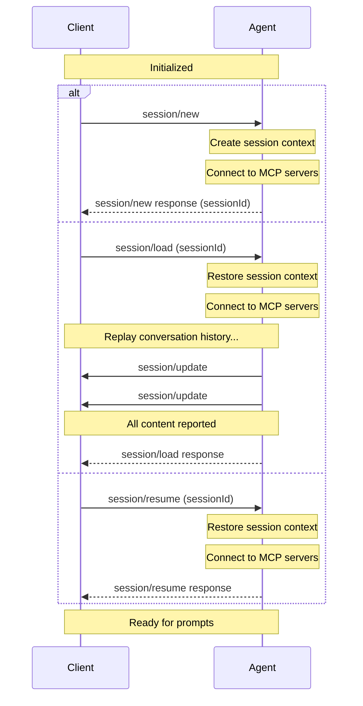

Sessions represent a specific conversation or thread between the [Client](/protocol/v2/draft/overview#client) and [Agent](/protocol/v2/draft/overview#agent). Each session maintains its own context, conversation history, and state, allowing multiple independent interactions with the same Agent.

Before creating a session, Clients **MUST** first complete the [initialization](/protocol/v2/draft/initialization) phase to establish protocol compatibility and capabilities.

If the Agent requires authentication, `session/new` may fail with an `auth_required` error until the Client completes the [authentication flow](/protocol/v2/draft/authentication).

<br />



<br />

## Creating a Session

Clients create a new session by calling the `session/new` method with:

- The [working directory](#working-directory) for the session
- A list of [MCP servers](#mcp-servers) the Agent should connect to

```json
{
  "jsonrpc": "2.0",
  "id": 1,
  "method": "session/new",
  "params": {
    "cwd": "/home/user/project",
    "mcpServers": [
      {
        "type": "stdio",
        "name": "workspace-tools",
        "command": "/path/to/mcp-server",
        "args": ["--stdio"],
        "env": []
      }
    ]
  }
}
```

The Agent **MUST** respond with a unique [Session ID](#session-id) that identifies this conversation:

```json
{
  "jsonrpc": "2.0",
  "id": 1,
  "result": {
    "sessionId": "sess_abc123def456"
  }
}
```

## Loading Sessions

Agents that support the `session.load` capability allow Clients to resume previous conversations with history replay. This feature enables persistence across restarts and sharing sessions between different Client instances.

### Checking Support

Before attempting to load a session, Clients **MUST** verify that the Agent supports this capability by checking the `session.load` field in the `initialize` response:

```json highlight={7}
{
  "jsonrpc": "2.0",
  "id": 0,
  "result": {
    "protocolVersion": 2,
    "capabilities": {
      "session": {
        "load": {}
      }
    }
  }
}
```

If `session.load` is omitted or `null`, the Agent does not support loading sessions and Clients **MUST NOT** attempt to call `session/load`.

### Loading a Session

To load an existing session, Clients **MUST** call the `session/load` method with:

- The [Session ID](#session-id) to resume
- [MCP servers](#mcp-servers) to connect to
- The [working directory](#working-directory)

```json
{
  "jsonrpc": "2.0",
  "id": 1,
  "method": "session/load",
  "params": {
    "sessionId": "sess_789xyz",
    "cwd": "/home/user/project",
    "mcpServers": [
      {
        "type": "stdio",
        "name": "workspace-tools",
        "command": "/path/to/mcp-server",
        "args": ["--mode", "workspace"],
        "env": []
      }
    ]
  }
}
```

The Agent **MUST** replay the entire conversation to the Client in the form of `session/update` notifications (like `session/prompt`). User, agent, and thought messages can each be replayed as message updates with full `content` arrays or as chunks.

For example, a user message from the conversation history:

```json
{
  "jsonrpc": "2.0",
  "method": "session/update",
  "params": {
    "sessionId": "sess_789xyz",
    "update": {
      "sessionUpdate": "user_message",
      "messageId": "msg_user_8f7a1",
      "content": [
        {
          "type": "text",
          "text": "What's the capital of France?"
        }
      ]
    }
  }
}
```

Followed by the agent's response:

```json
{
  "jsonrpc": "2.0",
  "method": "session/update",
  "params": {
    "sessionId": "sess_789xyz",
    "update": {
      "sessionUpdate": "agent_message",
      "messageId": "msg_agent_c42b9",
      "content": [
        {
          "type": "text",
          "text": "The capital of France is Paris."
        }
      ]
    }
  }
}
```

During replay, the Agent **MUST** include an opaque, unique `messageId` for each replayed message. `user_message`, `agent_message`, and `agent_thought` updates are upserts keyed by `messageId`; their `content` arrays replace the whole message content, while chunk updates with the same `messageId` append content.

Clients apply replayed message updates and chunks in the order they are received. If a message update with `content` arrives after chunks for the same `messageId`, it replaces the content accumulated from those chunks. If chunks arrive after a message update, they append to that update's current content. Message updates that omit `content` can update `_meta` or future fields without changing the current content.

When **all** the conversation entries have been reported to the Client, the
Agent **MUST** respond to the original `session/load` request.

```json
{
  "jsonrpc": "2.0",
  "id": 1,
  "result": {}
}
```

The response **MAY** also include initial session configuration state when that
feature is supported by the Agent.

The Client can then continue sending prompts as if the session was never
interrupted.

## Resuming Sessions

Agents that advertise `session.resume` allow Clients to reconnect to
an existing session without replaying the conversation history.

### Checking Support

Before attempting to resume a session, Clients **MUST** verify that the Agent
supports this capability by checking for the `session.resume` field
in the `initialize` response:

```json highlight={7-9}
{
  "jsonrpc": "2.0",
  "id": 0,
  "result": {
    "protocolVersion": 2,
    "capabilities": {
      "session": {
        "resume": {}
      }
    }
  }
}
```

If `session.resume` is not present, the Agent does not support
resuming sessions and Clients **MUST NOT** attempt to call `session/resume`.

### Resuming a Session

To resume an existing session without replaying prior messages, Clients
**MUST** call the `session/resume` method with:

- The [Session ID](#session-id) to resume
- [MCP servers](#mcp-servers) to connect to
- The [working directory](#working-directory)

```json
{
  "jsonrpc": "2.0",
  "id": 2,
  "method": "session/resume",
  "params": {
    "sessionId": "sess_789xyz",
    "cwd": "/home/user/project",
    "mcpServers": [
      {
        "type": "stdio",
        "name": "workspace-tools",
        "command": "/path/to/mcp-server",
        "args": ["--mode", "workspace"],
        "env": []
      }
    ]
  }
}
```

Unlike `session/load`, the Agent **MUST NOT** replay the conversation history
via `session/update` notifications before responding. Instead, it restores the
session context, reconnects to the requested MCP servers, and returns once the
session is ready to continue.

```json
{
  "jsonrpc": "2.0",
  "id": 2,
  "result": {}
}
```

The response **MAY** also include initial session configuration state when that
feature is supported by the Agent.

## Closing Active Sessions

Agents that advertise `session.close` allow Clients to tell the
Agent to cancel any ongoing work for a session and free any resources
associated with that active session.

### Checking Support

Before attempting to close a session, Clients **MUST** verify that the Agent
supports this capability by checking the `session.close` field in
the `initialize` response:

```json highlight={7-9}
{
  "jsonrpc": "2.0",
  "id": 0,
  "result": {
    "protocolVersion": 2,
    "capabilities": {
      "session": {
        "close": {}
      }
    }
  }
}
```

If `session.close` is not present, the Agent does not support
closing sessions and Clients **MUST NOT** attempt to call `session/close`.

### Closing a Session

To close an active session, Clients **MUST** call the `session/close` method
with the session ID:

```json
{
  "jsonrpc": "2.0",
  "id": 2,
  "method": "session/close",
  "params": {
    "sessionId": "sess_789xyz"
  }
}
```

<ParamField path="sessionId" type="SessionId" required>
  The ID of the active session to close.
</ParamField>

The Agent **MUST** cancel any ongoing work for that session as if
[`session/cancel`](/protocol/v2/draft/prompt-lifecycle#cancellation) had been called, then free the
resources associated with the session.

On success, the Agent responds with an empty result object:

```json
{
  "jsonrpc": "2.0",
  "id": 2,
  "result": {}
}
```

Agents MAY return an error if the session does not exist or is not currently
active.

## Additional Workspace Roots

Agents that advertise `session.additionalDirectories` allow Clients
to include `additionalDirectories` on supported session lifecycle requests to
expand the session's effective workspace root set. Supported stable lifecycle
requests include `session/new`, `session/load`, and `session/resume`.

```json
{
  "jsonrpc": "2.0",
  "id": 2,
  "method": "session/load",
  "params": {
    "sessionId": "sess_789xyz",
    "cwd": "/home/user/project",
    "additionalDirectories": [
      "/home/user/shared-lib",
      "/home/user/product-docs"
    ]
  }
}
```

When present, `additionalDirectories` has the following behavior:

- `cwd` remains the primary working directory and the base for relative paths
- each `additionalDirectories` entry **MUST** be an absolute path
- omitting the field or providing an empty array activates no additional roots for the resulting session
- on `session/load` and `session/resume`, Clients must send the full intended additional-root list again; that list may differ from any previous or reported list as long as the request `cwd` matches the session's `cwd`, and omitting the field or providing an empty array does not restore stored roots implicitly

Clients **MUST** only send `additionalDirectories` when the Agent advertises `session.additionalDirectories`.

## Session ID

The session ID returned by `session/new` is a unique identifier for the conversation context.

Clients use this ID to:

- Send prompt requests via `session/prompt`
- Cancel ongoing operations via `session/cancel`
- Load previous sessions via `session/load` (if the Agent supports the `session.load` capability)
- Resume previous sessions via `session/resume` (if the Agent supports the `session.resume` capability)
- Close active sessions via `session/close` (if the Agent supports the `session.close` capability)

## Working Directory

The `cwd` (current working directory) parameter establishes the primary file system context for the session. This directory:

- **MUST** be an absolute path
- **MUST** be used for the session regardless of where the Agent subprocess was spawned
- **MUST** remain the base for relative-path resolution
- **MUST** be part of the session's effective root set

When `session.additionalDirectories` is in use, the session's effective root set is `[cwd, ...additionalDirectories]`. This root set **SHOULD** serve as a boundary for tool operations on the file system.

## MCP Servers

The [Model Context Protocol (MCP)](https://modelcontextprotocol.io) allows Agents to access external tools and data sources. When creating a session, Clients **MAY** include connection details for MCP servers that the Agent should connect to.

MCP servers can be connected to using different transports. Agents advertise supported transports during initialization using `session.mcp.stdio`, `session.mcp.http`, and any extension-specific transport capabilities.

### Transport Types

Every MCP server object has a `type` discriminator that identifies its transport. Custom implementation-specific transport types **MUST** begin with `_`; unknown non-underscore transport types are reserved for future ACP variants.

#### Stdio Transport

When the Agent supports `session.mcp.stdio`, Clients can specify MCP servers configurations using the stdio transport.

<ParamField path="type" type="string" required>
  Must be `"stdio"` to indicate stdio transport
</ParamField>

<ParamField path="name" type="string" required>
  A human-readable identifier for the server
</ParamField>

<ParamField path="command" type="string" required>
  The absolute path to the MCP server executable
</ParamField>

<ParamField path="args" type="array">
  Command-line arguments to pass to the server. Omitted and empty values are
  equivalent.
</ParamField>

<ParamField path="env" type="EnvVariable[]">
  Environment variables to set when launching the server. Omitted and empty
  values are equivalent.

  <Expandable title="EnvVariable">
      <ParamField path="name" type="string">
        The name of the environment variable.
      </ParamField>
      <ParamField path="value" type="string">
        The value of the environment variable.
      </ParamField>
  </Expandable>
</ParamField>

Example stdio transport configuration:

```json
{
  "type": "stdio",
  "name": "workspace-tools",
  "command": "/path/to/mcp-server",
  "args": ["--stdio"],
  "env": [
    {
      "name": "API_KEY",
      "value": "secret123"
    }
  ]
}
```

#### HTTP Transport

When the Agent supports `session.mcp.http`, Clients can specify MCP servers configurations using the HTTP transport.

<ParamField path="type" type="string" required>
  Must be `"http"` to indicate HTTP transport
</ParamField>

<ParamField path="name" type="string" required>
  A human-readable identifier for the server
</ParamField>

<ParamField path="url" type="string" required>
  The URL of the MCP server
</ParamField>

<ParamField path="headers" type="HttpHeader[]">
  HTTP headers to include in requests to the server. Omitted and empty values are
  equivalent.

  <Expandable title="HttpHeader">
      <ParamField path="name" type="string">
        The name of the HTTP header.
      </ParamField>
      <ParamField path="value" type="string">
        The value to set for the HTTP header.
      </ParamField>
  </Expandable>
</ParamField>

Example HTTP transport configuration:

```json
{
  "type": "http",
  "name": "api-server",
  "url": "https://api.example.com/mcp",
  "headers": [
    {
      "name": "Authorization",
      "value": "Bearer token123"
    },
    {
      "name": "Content-Type",
      "value": "application/json"
    }
  ]
}
```

### Checking Transport Support

Before using stdio or HTTP transports, Clients **MUST** verify the Agent's capabilities during initialization:

```json highlight={7-10}
{
  "jsonrpc": "2.0",
  "id": 0,
  "result": {
    "protocolVersion": 2,
    "capabilities": {
      "session": {
        "mcp": {
          "stdio": {},
          "http": {}
        }
      }
    }
  }
}
```

If `session.mcp.stdio` is omitted or `null`, the Agent does not support stdio transport.
If `session.mcp.http` is omitted or `null`, the Agent does not support HTTP transport.
Supplying `{}` means the Agent supports the corresponding transport.

Agents **SHOULD** connect to all MCP servers specified by the Client.

Clients **MAY** use this ability to provide tools directly to the underlying language model by including their own MCP server.
