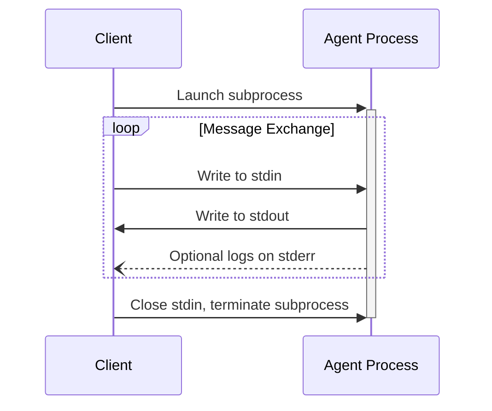

ACP uses JSON-RPC to encode messages. JSON-RPC messages **MUST** be UTF-8 encoded.

The protocol currently defines the following transport mechanisms for agent-client communication:

1. [stdio](#stdio), communication over standard in and standard out
2. _[Streamable HTTP](#streamable-http) (draft proposal in progress)_

Agents and clients **SHOULD** support stdio whenever possible.

It is also possible for agents and clients to implement [custom transports](#custom-transports).

## stdio

In the **stdio** transport:

- The client launches the agent as a subprocess.
- The agent reads JSON-RPC messages from its standard input (`stdin`) and sends messages to its standard output (`stdout`).
- Messages are individual JSON-RPC requests, notifications, responses, or
  batch arrays.
- Messages are delimited by newlines (`\n`), and **MUST NOT** contain embedded newlines.
- The agent **MAY** write UTF-8 strings to its standard error (`stderr`) for logging purposes. Clients **MAY** capture, forward, or ignore this logging.
- The agent **MUST NOT** write anything to its `stdout` that is not a valid ACP message.
- The client **MUST NOT** write anything to the agent's `stdin` that is not a valid ACP message.

## JSON-RPC Batch Messages

JSON-RPC 2.0 allows a sender to combine multiple request and notification
objects in a single batch array. ACP v2 follows the JSON-RPC 2.0 batch rules. A
client or agent **MAY** send an array filled with Request objects. A Notification
is a Request object without an `id`, so notification-only and mixed
request/notification batches are valid.

When receiving a batch call:

- If the batch itself is invalid JSON, return a single `Parse error` response
  (`code: -32700`) with `id: null`.
- The batch **MUST** be an array with at least one value. An empty array
  receives a single `Invalid Request` response (`code: -32600`) with `id: null`,
  not a response array.
- The receiver **MAY** process batch entries as concurrent tasks, in any order,
  and with any degree of parallelism.
- The receiver **SHOULD** respond with an array containing the corresponding
  Response objects after all batch Request objects have been processed.
- A Response object **SHOULD** exist for each Request object, except that there
  **SHOULD NOT** be any Response object for Notifications.
- The receiver **MUST NOT** reply to a Notification, including a Notification
  within a batch.
- Response objects **MAY** appear in any order within the response array. The
  sender **SHOULD** match responses to requests by `id`.
- If there are no Response objects to send, such as for an all-notification
  batch, the receiver **MUST NOT** return an empty array and should return
  nothing.
- Invalid entries in a non-empty batch produce their own `Invalid Request`
  responses (`code: -32600`) with `id: null`; they do not make the entire batch
  fail.

Clients and agents **SHOULD NOT** batch lifecycle-sensitive messages such as
`initialize`, `authenticate`, `session/new`, `session/load`, and
`session/prompt`. These messages are easier to reason about as individual
transport messages and can change which later messages are valid.

## _Streamable HTTP_

_In discussion, draft proposal in progress._

## Custom Transports

Agents and clients **MAY** implement additional custom transport mechanisms to suit their specific needs. The protocol is transport-agnostic and can be implemented over any communication channel that supports bidirectional message exchange.

Implementers who choose to support custom transports **MUST** ensure they preserve the JSON-RPC message format and lifecycle requirements defined by ACP. Custom transports **SHOULD** document their specific connection establishment and message exchange patterns to aid interoperability.
