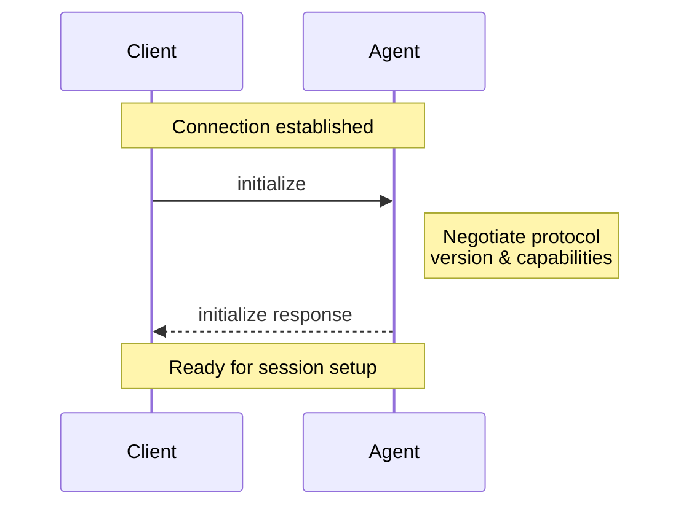

The Initialization phase allows [Clients](/protocol/v2/overview#client) and [Agents](/protocol/v2/overview#agent) to negotiate protocol versions, capabilities, and authentication methods.

<br />



<br />

Before a Session can be created, Clients **MUST** initialize the connection by calling the `initialize` method with:

- The latest [protocol version](#protocol-version) supported
- The [capabilities](#client-capabilities) supported
- The [implementation information](#implementation-information) for the Client

```json
{
  "jsonrpc": "2.0",
  "id": 0,
  "method": "initialize",
  "params": {
    "protocolVersion": 2,
    "capabilities": {},
    "info": {
      "name": "my-client",
      "title": "My Client",
      "version": "1.0.0"
    }
  }
}
```

The Agent **MUST** respond with the chosen [protocol version](#protocol-version), the [capabilities](#agent-capabilities) it supports, and its [implementation information](#implementation-information):

```json
{
  "jsonrpc": "2.0",
  "id": 0,
  "result": {
    "protocolVersion": 2,
    "capabilities": {
      "session": {
        "prompt": {
          "image": {},
          "audio": {},
          "embeddedContext": {}
        },
        "mcp": {
          "stdio": {},
          "http": {}
        },
        "load": {}
      }
    },
    "info": {
      "name": "my-agent",
      "title": "My Agent",
      "version": "1.0.0"
    },
    "authMethods": []
  }
}
```

## Protocol version

The protocol versions that appear in the `initialize` requests and responses are a single integer that identifies a **MAJOR** protocol version. This version is only incremented when breaking changes are introduced.

Clients and Agents **MUST** agree on a protocol version and act according to its specification.

See [Capabilities](#capabilities) to learn how non-breaking features are introduced.

### Version Negotiation

The `initialize` request **MUST** include the latest protocol version the Client supports.

If the Agent supports the requested version, it **MUST** respond with the same version. Otherwise, the Agent **MUST** respond with the latest version it supports.

If the Client does not support the version specified by the Agent in the `initialize` response, the Client **SHOULD** close the connection and inform the user about it.

## Capabilities

Capabilities describe features supported by the Client and the Agent.

All capabilities included in the `initialize` request are **OPTIONAL**. Clients and Agents **SHOULD** support all possible combinations of their peer's capabilities.

The introduction of new capabilities is not considered a breaking change. Therefore, Clients and Agents **MUST** treat all capabilities omitted in the `initialize` request as **UNSUPPORTED**.

Capabilities may advertise top-level method surfaces or nested features that
only apply within a supported surface.

Capabilities may specify the availability of protocol methods, notifications, or a subset of their parameters. They may also signal behaviors of the Agent or Client implementation.

Implementations can also [advertise custom capabilities](/protocol/v2/extensibility#advertising-custom-capabilities) using the `_meta` field to indicate support for protocol extensions.

### Client Capabilities

Clients **MAY** include defined capability fields in `capabilities`.
Omitted fields mean unsupported. Extension-specific capabilities belong in
`_meta`.

### Agent Capabilities

The Agent **SHOULD** specify whether it supports the following capabilities:

<ResponseField name="session" type="SessionCapabilities Object">
  The Agent supports the `session/*` method surface. Omitted or `null` means the
  Agent does not support session methods. Supplying `{}` means the Agent
  supports the baseline session methods: `session/new`, `session/prompt`,
  `session/cancel`, and `session/update`.
</ResponseField>

<ResponseField name="auth" type="AgentAuthCapabilities Object">
  Authentication-related capabilities supported by the Agent.
</ResponseField>

#### Session Capabilities

Supplying `session: {}` means the Agent supports `session/new`, `session/prompt`, `session/cancel`, and `session/update`.

Optionally, Agents **MAY** support prompt extensions, MCP server transports, and additional session methods by specifying nested capabilities.

<ResponseField name="prompt" type="PromptCapabilities Object">
  Object indicating the different types of [content](/protocol/v2/content) that
  may be included in `session/prompt` requests. Omitted or `null` means the
  Agent does not advertise any prompt extensions beyond the baseline text and
  resource-link content required by `session/prompt`.
</ResponseField>

<ResponseField name="mcp" type="McpCapabilities Object">
  Object indicating the MCP server transports that may be included in session
  lifecycle requests. Omitted or `null` means the Agent does not advertise MCP
  server transport support for sessions.
</ResponseField>

<ResponseField name="load" type="SessionLoadCapabilities Object">
  The [`session/load`](/protocol/v2/session-setup#loading-sessions) method is
  available. Omitted or `null` means the Agent does not advertise support.
  Supplying `{}` means the Agent supports loading sessions.
</ResponseField>

<ResponseField name="delete" type="SessionDeleteCapabilities Object">
  The [`session/delete`](/protocol/v2/session-delete) method is available.
  Omitted or `null` means the Agent does not advertise support. Supplying `{}`
  means the Agent supports deleting sessions from `session/list`.
</ResponseField>

<ResponseField
  name="additionalDirectories"
  type="SessionAdditionalDirectoriesCapabilities Object"
>
  The Agent supports `additionalDirectories` on supported session lifecycle
  requests. Omitted or `null` means the Agent does not advertise support.
  Supplying `{}` means the Agent supports additional workspace roots.
</ResponseField>

#### Session Prompt Capabilities

As a baseline, Agents that advertise `session` **MUST** support `ContentBlock::Text` and `ContentBlock::ResourceLink` in `session/prompt` requests.

Optionally, they **MAY** support richer types of [content](/protocol/v2/content) by specifying the following capabilities:

<ResponseField name="image" type="PromptImageCapabilities Object">
  The prompt may include `ContentBlock::Image`. Omitted or `null` means the
  Agent does not advertise support. Supplying `{}` means the Agent supports
  image content in prompts.
</ResponseField>

<ResponseField name="audio" type="PromptAudioCapabilities Object">
  The prompt may include `ContentBlock::Audio`. Omitted or `null` means the
  Agent does not advertise support. Supplying `{}` means the Agent supports
  audio content in prompts.
</ResponseField>

<ResponseField
  name="embeddedContext"
  type="PromptEmbeddedContextCapabilities Object"
>
  The prompt may include `ContentBlock::Resource`. Omitted or `null` means the
  Agent does not advertise support. Supplying `{}` means the Agent supports
  embedded context in prompts.
</ResponseField>

#### Session MCP Capabilities

<ResponseField name="stdio" type="McpStdioCapabilities Object">
  The Agent supports connecting to MCP servers over stdio. Omitted or `null`
  means the Agent does not advertise support. Supplying `{}` means the Agent
  supports stdio MCP server transports.
</ResponseField>

<ResponseField name="http" type="McpHttpCapabilities Object">
  The Agent supports connecting to MCP servers over HTTP. Omitted or `null`
  means the Agent does not advertise support. Supplying `{}` means the Agent
  supports HTTP MCP server transports.
</ResponseField>

<Card icon="shield-check" horizontal href="/protocol/v2/authentication">
  Learn more about Authentication
</Card>

## Implementation Information

Both Clients and Agents **MUST** provide information about their implementation in the `info` field. It takes the following three fields:

<ParamField path="name" type="string">
  Intended for programmatic or logical use, but can be used as a display name
  fallback if title isn’t present.
</ParamField>

<ParamField path="title" type="string">
  Intended for UI and end-user contexts — optimized to be human-readable and
  easily understood. If not provided, the name should be used for display.
</ParamField>

<ParamField path="version" type="string">
  Version of the implementation. Can be displayed to the user or used for
  debugging or metrics purposes.
</ParamField>

---

Once the connection is initialized, you're ready to [create a session](/protocol/v2/session-setup) and begin the conversation with the Agent.
