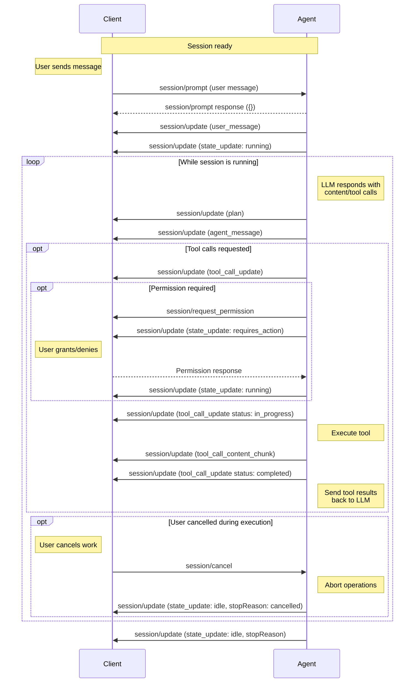

A prompt starts or contributes to active work in a session. The [Agent](/protocol/v2/overview#agent) may continue processing until it reports that the session is idle again, and it may emit `session/update` notifications before or after an individual prompt request has completed. Active work can involve multiple exchanges with the language model and tool invocations.

`session/prompt` only lasts until the Agent accepts the prompt. The Agent reports the accepted user message, running state, output, and completion through `session/update` notifications.

Before sending prompts, Clients **MUST** first complete the [initialization](/protocol/v2/initialization) phase and [session setup](/protocol/v2/session-setup).

## Prompt Lifecycle

A typical prompt-driven flow enables rich interactions between the user, Agent, and any connected tools.

<br />



### 1. User Message

The Client sends a user message with `session/prompt`:

```json
{
  "jsonrpc": "2.0",
  "id": 2,
  "method": "session/prompt",
  "params": {
    "sessionId": "sess_abc123def456",
    "prompt": [
      {
        "type": "text",
        "text": "Can you analyze this code for potential issues?"
      },
      {
        "type": "resource",
        "resource": {
          "uri": "file:///home/user/project/main.py",
          "mimeType": "text/x-python",
          "text": "def process_data(items):\n    for item in items:\n        print(item)"
        }
      }
    ]
  }
}
```

<ParamField path="sessionId" type="SessionId">
    The [ID](/protocol/v2/session-setup#session-id) of the session to send this message to.
</ParamField>
<ParamField path="prompt" type="ContentBlock[]">
    The contents of the user message, e.g. text, images, files, etc.

    Clients **MUST** restrict types of content according to the [Prompt Capabilities](/protocol/v2/initialization#prompt-capabilities) established during [initialization](/protocol/v2/initialization).

    <Card icon="comments" horizontal href="/protocol/v2/content">
      Learn more about Content
    </Card>

</ParamField>

### 2. Prompt Accepted

Upon receiving a prompt request, the Agent **MUST** respond once it has accepted the prompt. The response body is empty because completion is reported through `state_update` notifications, not through the `session/prompt` response:

```json
{
  "jsonrpc": "2.0",
  "id": 2,
  "result": {}
}
```

After accepting the prompt, the Agent **MUST** report where the user message was inserted in session history. It can send either a `user_message` update with the full `content` array or streamed `user_message_chunk` updates. This update is the source of truth for the agent-owned `messageId`.

```json
{
  "jsonrpc": "2.0",
  "method": "session/update",
  "params": {
    "sessionId": "sess_abc123def456",
    "update": {
      "sessionUpdate": "user_message",
      "messageId": "msg_user_8f7a1",
      "content": [
        {
          "type": "text",
          "text": "Can you analyze this code for potential issues?"
        }
      ]
    }
  }
}
```

### 3. Agent Reports Output

When the Agent starts or resumes processing work for the session, it **MUST** send a `state_update` notification with `state: "running"`:

```json
{
  "jsonrpc": "2.0",
  "method": "session/update",
  "params": {
    "sessionId": "sess_abc123def456",
    "update": {
      "sessionUpdate": "state_update",
      "state": "running"
    }
  }
}
```

The language model **MAY** respond with text content, tool calls, or both.

The Agent reports the model's output to the Client via `session/update` notifications. This may include the Agent's plan for accomplishing the task:

```json expandable
{
  "jsonrpc": "2.0",
  "method": "session/update",
  "params": {
    "sessionId": "sess_abc123def456",
    "update": {
      "sessionUpdate": "plan_update",
      "plan": {
        "type": "items",
        "id": "plan-1",
        "entries": [
          {
            "content": "Check for syntax errors",
            "priority": "high",
            "status": "pending"
          },
          {
            "content": "Identify potential type issues",
            "priority": "medium",
            "status": "pending"
          },
          {
            "content": "Review error handling patterns",
            "priority": "medium",
            "status": "pending"
          },
          {
            "content": "Suggest improvements",
            "priority": "low",
            "status": "pending"
          }
        ]
      }
    }
  }
}
```

<Card icon="lightbulb" horizontal href="/protocol/v2/agent-plan">
  Learn more about Agent Plans
</Card>

The Agent can report the model's text response as an `agent_message` update with the full `content` array:

```json
{
  "jsonrpc": "2.0",
  "method": "session/update",
  "params": {
    "sessionId": "sess_abc123def456",
    "update": {
      "sessionUpdate": "agent_message",
      "messageId": "msg_agent_c42b9",
      "content": [
        {
          "type": "text",
          "text": "I'll analyze your code for potential issues. Let me examine it..."
        }
      ]
    }
  }
}
```

#### Message IDs

The Agent **MUST** include an opaque `messageId` on message updates and message chunks.

User, agent, and thought messages can each be reported either as a message update with a full `content` array or as streamed chunks. `user_message`, `agent_message`, and `agent_thought` updates are upserts keyed by `messageId`: omitted fields leave the existing message unchanged, `null` clears a field, and concrete values replace the previous value. `content` arrays replace the whole message content; send `[]` or `null` to clear content. Chunk updates with the same `messageId` append content; a changed `messageId` indicates a new message.

Clients apply message updates and chunks in the order they are received for each `messageId`:

- A message update without `content` leaves the current content unchanged, so Agents can update `_meta` or future optional fields without resending content.
- A message update with `content` replaces all content currently stored for that message, including content accumulated from earlier chunks.
- A message update with `content: []` or `content: null` clears the message content.
- A chunk appends its `content` to whatever content is current for that message, whether that content came from an earlier message update or earlier chunks.

For example, if an Agent sends `agent_message` with `content: [A]`, then sends `agent_message_chunk` with `B`, the rendered message content is `[A, B]`. If it later sends another `agent_message` with `content: [C]`, the rendered content becomes `[C]`; the earlier full content and chunks are replaced. Subsequent chunks append to `[C]`.

For streaming agent text, the Agent can use `agent_message_chunk` updates:

```json
{
  "jsonrpc": "2.0",
  "method": "session/update",
  "params": {
    "sessionId": "sess_abc123def456",
    "update": {
      "sessionUpdate": "agent_message_chunk",
      "messageId": "msg_agent_c42b9",
      "content": {
        "type": "text",
        "text": " Let me examine it..."
      }
    }
  }
}
```

The Agent can report internal reasoning with the same message-update or chunk patterns. `agent_thought` updates patch fields for the same thought `messageId`; `agent_thought_chunk` updates append new content.

```json
{
  "jsonrpc": "2.0",
  "method": "session/update",
  "params": {
    "sessionId": "sess_abc123def456",
    "update": {
      "sessionUpdate": "agent_thought",
      "messageId": "msg_thought_a12",
      "content": [
        {
          "type": "text",
          "text": "Need to inspect the loop body before suggesting a fix."
        }
      ]
    }
  }
}
```

If the model requested tool calls, these are also reported immediately:

```json
{
  "jsonrpc": "2.0",
  "method": "session/update",
  "params": {
    "sessionId": "sess_abc123def456",
    "update": {
      "sessionUpdate": "tool_call_update",
      "toolCallId": "call_001",
      "title": "Analyzing Python code",
      "kind": "other",
      "status": "pending"
    }
  }
}
```

#### Session Usage Updates

The Agent **MAY** also report current session context and cumulative cost state with a `usage_update`:

```json
{
  "jsonrpc": "2.0",
  "method": "session/update",
  "params": {
    "sessionId": "sess_abc123def456",
    "update": {
      "sessionUpdate": "usage_update",
      "used": 53000,
      "size": 200000,
      "cost": {
        "amount": 0.045,
        "currency": "USD"
      }
    }
  }
}
```

`used` and `size` are required and non-null token counts for the current session context. `cost` is optional and, if present, `amount` and `currency` are required. `currency` is an ISO 4217 currency code like `"USD"`.

### 4. Report Completion

If there is no pending work, the Agent **MUST** report that the session is idle with a `state_update` notification. When the idle transition completes active work, the Agent **MUST** include the corresponding [`StopReason`](#stop-reasons):

```json
{
  "jsonrpc": "2.0",
  "method": "session/update",
  "params": {
    "sessionId": "sess_abc123def456",
    "update": {
      "sessionUpdate": "state_update",
      "state": "idle",
      "stopReason": "end_turn"
    }
  }
}
```

Agents **MAY** stop active work at any point by sending an idle `state_update` session update with the corresponding [`StopReason`](#stop-reasons).

### 5. Tool Invocation and Status Reporting

Before proceeding with execution, the Agent **MAY** request permission from the Client via the `session/request_permission` method.

While waiting for a permission response or other user action, the Agent **SHOULD** send a `state_update` notification with `state: "requires_action"`. When the Agent resumes processing, it **SHOULD** send another `state_update` notification with `state: "running"`.

Once permission is granted (if required), the Agent **SHOULD** invoke the tool and report a status update marking the tool as `in_progress`:

```json
{
  "jsonrpc": "2.0",
  "method": "session/update",
  "params": {
    "sessionId": "sess_abc123def456",
    "update": {
      "sessionUpdate": "tool_call_update",
      "toolCallId": "call_001",
      "status": "in_progress"
    }
  }
}
```

As the tool runs, the Agent **MAY** send additional updates, providing real-time feedback about tool execution progress. When the tool produces incremental content, the Agent can stream each item with `tool_call_content_chunk`:

```json
{
  "jsonrpc": "2.0",
  "method": "session/update",
  "params": {
    "sessionId": "sess_abc123def456",
    "update": {
      "sessionUpdate": "tool_call_content_chunk",
      "toolCallId": "call_001",
      "content": {
        "type": "content",
        "content": {
          "type": "text",
          "text": "Checked syntax..."
        }
      }
    }
  }
}
```

Clients append each `tool_call_content_chunk` to the current content for that `toolCallId`. A later `tool_call_update` with `content` replaces the accumulated content.

While tools execute on the Agent, they **MAY** leverage Client capabilities negotiated during initialization.

When the tool completes, the Agent sends another update with the final status and any content:

```json
{
  "jsonrpc": "2.0",
  "method": "session/update",
  "params": {
    "sessionId": "sess_abc123def456",
    "update": {
      "sessionUpdate": "tool_call_update",
      "toolCallId": "call_001",
      "status": "completed",
      "content": [
        {
          "type": "content",
          "content": {
            "type": "text",
            "text": "Analysis complete:\n- No syntax errors found\n- Consider adding type hints for better clarity\n- The function could benefit from error handling for empty lists"
          }
        }
      ]
    }
  }
}
```

<Card icon="hammer" horizontal href="/protocol/v2/tool-calls">
  Learn more about Tool Calls
</Card>

### 6. Continue Conversation

The Agent sends the tool results back to the language model as another request.

The cycle returns to [step 3](#3-agent-reports-output), continuing until the language model completes its response without requesting additional tool calls or active work is stopped by the Agent or cancelled by the Client.

## Stop Reasons

When an Agent stops active work, it must specify the corresponding `StopReason` on an idle `state_update` session update:

<ResponseField name="end_turn">
  The Agent has no more work to perform after the language model finishes
  responding without requesting more tools
</ResponseField>

<ResponseField name="max_tokens">
  The maximum token limit is reached
</ResponseField>

<ResponseField name="max_turn_requests">
  The maximum number of model requests for the active work is exceeded
</ResponseField>

<ResponseField name="refusal">The Agent refuses to continue</ResponseField>

<ResponseField name="cancelled">The Client cancels active work</ResponseField>

Custom or future stop reasons can be used when Clients can display a generic stopped state. Custom stop reasons **MUST** begin with `_`; unknown non-underscore stop reasons are reserved for future ACP variants.

## Session States

<ResponseField name="running">
  The Agent is actively processing work in the session.
</ResponseField>

<ResponseField name="idle">
  The Agent is not currently processing work in the session.
</ResponseField>

<ResponseField name="requires_action">
  The Agent is waiting on user action before it can continue.
</ResponseField>

## Cancellation

Clients **MAY** cancel active session work at any time by sending a `session/cancel` notification:

```json
{
  "jsonrpc": "2.0",
  "method": "session/cancel",
  "params": {
    "sessionId": "sess_abc123def456"
  }
}
```

The Client **SHOULD** preemptively mark all non-finished tool calls pertaining to the current active work as `cancelled` as soon as it sends the `session/cancel` notification.

The Client **MUST** respond to all pending `session/request_permission` requests with the `cancelled` outcome.

When the Agent receives this notification, it **SHOULD** stop all language model requests and all tool call invocations as soon as possible.

After all ongoing operations have been successfully aborted and pending updates have been sent, the Agent **MUST** send an idle `state_update` session update with the `cancelled` [stop reason](#stop-reasons).

<Warning>
  API client libraries and tools often throw an exception when their operation is aborted, which may otherwise be surfaced as a generic failure.

Clients often display unrecognized errors from the Agent to the user, which would be undesirable for cancellations as they aren't considered errors.

Agents **MUST** catch these errors and report the semantically meaningful `cancelled` stop reason on a `state_update` notification, so that Clients can reliably confirm the cancellation.

</Warning>

The Agent **MAY** send `session/update` notifications with content or tool call updates after receiving the `session/cancel` notification, but it **MUST** ensure that it does so before sending the idle `state_update` session update that reports cancellation.

The Client **SHOULD** still accept tool call updates received after sending `session/cancel`.

---

After the Agent reports the session is idle, the Client may send another `session/prompt` to continue the conversation, building on the established session context.
