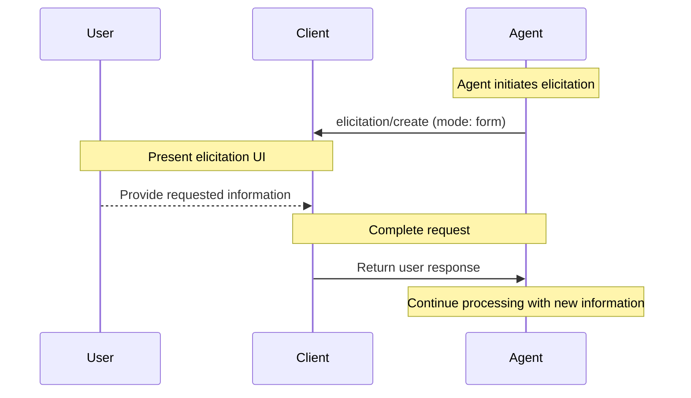
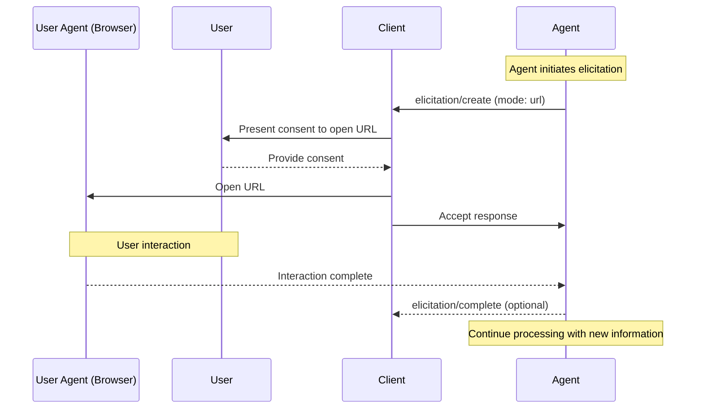

- Author(s): [@yordis](https://github.com/yordis)
- Champion: [@benbrandt](https://github.com/benbrandt)

## Elevator pitch

Add support for agents to request information from users through a standardized elicitation mechanism, aligned with the form and URL data model in the locked [MCP 2026-07-28 release candidate](https://modelcontextprotocol.io/specification/draft/client/elicitation). This allows agents to ask follow-up questions, coordinate secure authentication flows, gather preferences, and request required information without ad-hoc client UI implementations.

## Status quo

Currently, agents have two limited mechanisms for gathering user input:

1. **Session Config Options** (PR #210): Pre-declared, persistent configuration (model, mode, etc.) with default values required. These are available at session initialization and changes are broadcast to the client.

2. **Unstructured text in turn responses**: Agents can include prompts in their responses, but clients have no standardized way to recognize auth requests, form inputs, or structured selections, leading to inconsistent UX across agents.

However, there is no mechanism for agents to:

- Request ad-hoc information during a turn (e.g., "Which of these approaches should I proceed with?" from PR #340)
- Coordinate authentication without passing credentials through ACP (pain point from PR #330)
- Collect open-ended text input with validation constraints
- Handle decision points that weren't anticipated at session initialization
- Request sensitive information via out-of-band mechanisms (browser-based OAuth)

The community has already identified the need for this: PR #340 explored a `session/select` mechanism but concluded that leveraging an MCP-like elicitation pattern would be more aligned with how clients will already support MCP servers. PR #330 recognized that authentication requests specifically need special handling separate from regular session data.

This gap limits the richness of agent-client interaction and forces both agents and clients to implement ad-hoc solutions for structured user input.

## What we propose to do about it

We propose introducing an elicitation mechanism for agents to request information from users, aligned with the locked [MCP 2026-07-28 release-candidate elicitation specification](https://modelcontextprotocol.io/specification/draft/client/elicitation). This addresses discussions from PR #340 about standardizing user selection flows and PR #330 about secure authentication handling.

The mechanism would:

1. **Use restricted JSON Schema** (as discussed in PR #210): Like MCP, constrain JSON Schema to a useful subset—flat objects with primitive properties (`string`, `number`, `integer`, `boolean`) plus supported formats and enum values. Clients decide how to render UI based on the schema.

2. **Support two elicitation modes** (drawing on the historical design in [MCP SEP-1036](https://modelcontextprotocol.io/seps/1036-url-mode-elicitation-for-secure-out-of-band-intera); the locked release candidate is the normative alignment target):
   - **Form mode** (in-band): Structured data collection via JSON Schema forms
   - **URL mode** (out-of-band): Browser-based flows for sensitive operations like OAuth (addressing PR #330 authentication pain points)

3. **Request/response pattern**: Agents send elicitation requests via an `elicitation/create` method and receive responses. The agent controls when to send requests and whether to wait for responses before proceeding. Unlike Session Config Options (which are persistent), elicitation requests are transient.

4. **Support client capability negotiation**: Clients declare elicitation support via a structured capability object that distinguishes between `form`-based and `url`-based elicitation (following MCP's capability model). This allows clients to support one or both modalities, enables agents to pass capabilities along to MCP servers, and handles graceful degradation when clients have limited elicitation support.

5. **Provide rich context**: Agents can include title, description, detailed constraints, and examples—helping clients render consistent, helpful UI without custom implementations.

6. **Enable out-of-band flows**: Support URL-mode elicitation (like MCP) for sensitive operations like authentication, where credentials do not transit over ACP or enter the Client or model context (addressing the core pain point in PR #330).

## Shiny future

Once implemented, agents can:

- Ask users "Which approach would you prefer: A or B?" and receive a structured response
- Request text input: "What's the name for this function?"
- Collect multiple related pieces of information in a single request
- Guide users through decision trees with follow-up questions
- Provide rich context (descriptions, examples, constraints) for what they're asking for

Clients can:

- Present a consistent, standardized UI for elicitation across all agents
- Validate user input against constraints before sending to the agent
- Cache elicitation history and offer suggestions based on previous responses
- Provide keyboard shortcuts and accessibility features for common elicitation types

## Implementation details and plan

### Alignment with MCP

This proposal adopts the form and URL payloads, response actions, restricted
JSON Schema approach, and safety guidance from the locked
[MCP 2026-07-28 release-candidate elicitation specification](https://modelcontextprotocol.io/specification/draft/client/elicitation).
MCP delivers an `elicitation/create` input request inside an
`InputRequiredResult`, after which the Client retries the originating request.
ACP adapts that data model to its persistent bidirectional connection by
sending `elicitation/create` directly from the Agent to the Client.

Key differences from MCP:

- MCP carries elicitation only inside an `InputRequiredResult` associated with an originating Client request; ACP sends a direct request and makes its scope explicit as session-scoped, tool-call-scoped, or request-scoped
- ACP requires an explicit `mode`; MCP permits form mode requests to omit it
- ACP negotiates Client capabilities during initialization, while MCP 2026-07-28 carries them per request
- ACP requires `form` or `url` to be explicitly advertised in Client capabilities; unlike MCP, an empty capability object does not imply form support
- ACP URL requests add `elicitationId` and MAY be followed by `elicitation/complete`; MCP 2026-07-28 has neither and determines completion when the Client retries the originating request
- ACP has no separate URL-required error; Agents request URL mode directly
- ACP includes an optional `toolCallId` field to support tool-call-scoped elicitations (e.g., when an agent receives an MCP elicitation during a tool call and needs to redirect it to the user)
- ACP omits MCP's optional `$schema` field because ACP fixes the exact restricted schema subset rather than allowing the sender to select or annotate a schema dialect
- ACP extends MCP's restricted schema subset with `pattern`, schema-level `title` and `description`, descriptions on titled enum options, and `_meta`. ACP preserves unknown schema types and response actions for forward compatibility, and does not support MCP's deprecated `enumNames`
- ACP must integrate with existing Session Config Options (which also use schema constraints)

### Elicitation Request Structure

Agents send elicitation requests when they need information from the user. This is a request/response pattern—the agent sends the request and waits for the client's response.

**Example 1: Form Mode - User Selection (from PR #340)**

```json
{
  "sessionId": "sess_abc123",
  "mode": "form",
  "message": "How would you like me to approach this refactoring?",
  "requestedSchema": {
    "type": "object",
    "properties": {
      "strategy": {
        "type": "string",
        "title": "Refactoring Strategy",
        "description": "Choose how aggressively to refactor",
        "oneOf": [
          {
            "const": "conservative",
            "title": "Conservative - Minimal changes",
            "description": "Make minimal changes and avoid broad cleanup."
          },
          {
            "const": "balanced",
            "title": "Balanced (Recommended)",
            "description": "Fix the issue and clean nearby code when it lowers risk."
          },
          {
            "const": "aggressive",
            "title": "Aggressive - Maximum optimization",
            "description": "Refactor more broadly to optimize the affected area."
          }
        ],
        "default": "balanced"
      }
    },
    "required": ["strategy"]
  }
}
```

**Example 2: URL Mode - Authentication (from PR #330, out-of-band OAuth)**

```json
{
  "requestId": 12,
  "mode": "url",
  "elicitationId": "github-oauth-123",
  "url": "https://agent.example.com/connect?elicitationId=github-oauth-123",
  "message": "Please authorize access to your GitHub repositories to continue."
}
```

**Example 3: Form Mode - Text Input with Constraints**

```json
{
  "sessionId": "sess_abc123",
  "mode": "form",
  "message": "What should this function be named?",
  "requestedSchema": {
    "type": "object",
    "properties": {
      "name": {
        "type": "string",
        "title": "Function Name",
        "description": "Must be a valid identifier",
        "minLength": 1,
        "maxLength": 64,
        "pattern": "^[a-zA-Z_][a-zA-Z0-9_]*$",
        "default": "processData"
      }
    },
    "required": ["name"]
  }
}
```

**Example 4: Form Mode - Multiple Fields**

```json
{
  "sessionId": "sess_abc123",
  "mode": "form",
  "message": "Please provide configuration details",
  "requestedSchema": {
    "type": "object",
    "properties": {
      "name": {
        "type": "string",
        "title": "Project Name"
      },
      "port": {
        "type": "integer",
        "title": "Port Number",
        "minimum": 1024,
        "maximum": 65535,
        "default": 3000
      },
      "enableLogging": {
        "type": "boolean",
        "title": "Enable Logging",
        "default": true
      }
    },
    "required": ["name"]
  }
}
```

### Elicitation Modes

Following the locked MCP release candidate's approach, elicitation supports two modes. [SEP-1036](https://modelcontextprotocol.io/seps/1036-url-mode-elicitation-for-secure-out-of-band-intera) provides historical design background for URL mode.

**Form mode** (in-band): Agents request structured data from users using restricted JSON Schema. The Client decides how to render the form UI based on the schema.

**URL mode** (out-of-band): Agents direct users to external URLs for sensitive interactions. Inputs entered during the interaction do not transit over ACP or enter the Client or model context (OAuth flows, payments, credential collection, etc.).

This distinction is reflected in the client capabilities model, allowing clients to declare support for one or both modalities.

**Normative requirements:**

- Form support exists only when `form` is present and non-null, and URL support
  exists only when `url` is present and non-null. `{}` and objects whose mode
  fields are all omitted or `null` advertise no supported modes.
- Agents MUST NOT send elicitation requests with modes that are not supported by the client.
- For URL mode, the `url` parameter MUST contain a valid URL.

Unknown elicitation `mode` values are reserved for future ACP variants or implementation-specific extensions. Implementation-specific modes MUST begin with `_`. Clients that do not understand a mode should preserve the raw payload when storing, replaying, proxying, or forwarding elicitation requests, but MUST NOT render it as `form` or `url` or otherwise treat it as supported.

### User Interaction Requirements

Clients MUST clearly identify the Agent requesting information, respect user
privacy, and provide clear decline and cancel controls. For form mode, Clients
MUST let users review and modify responses before sending them. For URL mode,
Clients MUST display the target host and obtain consent before navigating to
it. Clients SHOULD present the request's `message` so users understand what is
requested and why.

### Restricted JSON Schema

Aligning with the locked [MCP 2026-07-28 release-candidate elicitation specification](https://modelcontextprotocol.io/specification/draft/client/elicitation), form mode elicitation uses a restricted subset of JSON Schema. Schemas are limited to flat objects with primitive properties only—the client decides how to render appropriate input UI based on the schema.

Senders MUST include both `type: "object"` and `properties` in every
`requestedSchema`. For compatibility, ACP readers tolerate an omitted, `null`,
or malformed `type` by treating it as `"object"`, and tolerate omitted
`properties` by treating it as an empty map; `null` is not valid for
`properties`. This reader tolerance does not relax the sender requirements.
ACP does not include MCP's optional `$schema` field because the ACP protocol
defines the exact restricted subset and does not support sender-selected schema
dialects.

ACP extends MCP's restricted subset with `pattern`, schema-level `title` and
`description`, descriptions on titled enum options, and `_meta`. It also
preserves unknown schema types and response actions for forward compatibility.
ACP does not support MCP's deprecated `enumNames`; use `oneOf` for titled
single-select choices and `anyOf` for titled multi-select choices.

**Supported primitive types:**

1. **String Schema**

```json
{
  "type": "string",
  "title": "Display Name",
  "description": "Description text",
  "minLength": 3,
  "maxLength": 50,
  "pattern": "^[A-Za-z]+$",
  "format": "email",
  "default": "user@example.com"
}
```

Because `pattern` is supplied by an Agent, implementations that evaluate it
MUST use a regex engine or execution limits that bound evaluation time and
resource use. A malicious or pathological pattern MUST NOT be allowed to block
Client UI or unboundedly consume resources.

Known formats include `email`, `uri`, `date`, and `date-time`. Other string
format values are annotations. Implementations MUST preserve unknown formats
when storing, replaying, proxying, or forwarding schemas and MUST NOT reject a
schema solely because its string format is unknown.

2. **Number Schema**

```json
{
  "type": "number",
  "title": "Display Name",
  "description": "Description text",
  "minimum": 0,
  "maximum": 100,
  "default": 50
}
```

Also supports `"type": "integer"` for whole numbers.

3. **Boolean Schema**

```json
{
  "type": "boolean",
  "title": "Display Name",
  "description": "Description text",
  "default": false
}
```

4. **Enum Schema** (for selections)

Single-select enum (without titles):

```json
{
  "type": "string",
  "title": "Color Selection",
  "description": "Choose your favorite color",
  "enum": ["Red", "Green", "Blue"],
  "default": "Red"
}
```

Single-select enum (with titles):

```json
{
  "type": "string",
  "title": "Color Selection",
  "description": "Choose your favorite color",
  "oneOf": [
    {
      "const": "#FF0000",
      "title": "Red",
      "description": "High emphasis and warning-oriented."
    },
    {
      "const": "#00FF00",
      "title": "Green",
      "description": "Positive status and success-oriented."
    },
    {
      "const": "#0000FF",
      "title": "Blue",
      "description": "Neutral and informational."
    }
  ],
  "default": "#FF0000"
}
```

Multi-select enum (without titles):

```json
{
  "type": "array",
  "title": "Color Selection",
  "description": "Choose your favorite colors",
  "minItems": 1,
  "maxItems": 2,
  "items": {
    "type": "string",
    "enum": ["Red", "Green", "Blue"]
  },
  "default": ["Red", "Green"]
}
```

Multi-select enum (with titles):

```json
{
  "type": "array",
  "title": "Color Selection",
  "description": "Choose your favorite colors",
  "minItems": 1,
  "maxItems": 2,
  "items": {
    "anyOf": [
      {
        "const": "#FF0000",
        "title": "Red",
        "description": "High emphasis and warning-oriented."
      },
      {
        "const": "#00FF00",
        "title": "Green",
        "description": "Positive status and success-oriented."
      },
      {
        "const": "#0000FF",
        "title": "Blue",
        "description": "Neutral and informational."
      }
    ]
  },
  "default": ["#FF0000", "#00FF00"]
}
```

Unknown multi-select `items.type` values are reserved for future ACP variants or implementation-specific extensions. Implementation-specific values MUST begin with `_`. Clients that do not understand a multi-select item type should preserve the raw `items` schema when storing, replaying, proxying, or forwarding elicitation requests, but MUST NOT render it as string multi-select items.

**Request schema structure:**

```json
{
  "requestedSchema": {
    "type": "object",
    "properties": {
      "propertyName": {
        "type": "string",
        "title": "Display Name",
        "description": "Description of the property"
      },
      "anotherProperty": {
        "type": "number",
        "minimum": 0,
        "maximum": 100
      }
    },
    "required": ["propertyName"]
  }
}
```

**Not supported** (to simplify client implementation):

- Complex nested objects/arrays (beyond enum arrays)
- Conditional validation

Unknown property schema `type` values are reserved for future ACP variants or implementation-specific extensions. Implementation-specific values MUST begin with `_`. Clients that do not understand a property schema type should preserve the raw schema when storing, replaying, proxying, or forwarding elicitation requests, but MUST NOT render it as a known input control.

Clients use this schema to generate appropriate input forms, validate user input before sending, and provide better guidance to users. All primitive types support optional default values; clients SHOULD pre-populate form fields with these values.

**Security note:** Following MCP, Agents MUST NOT use form mode elicitation to request secrets or credentials that grant access or authorize transactions, such as passwords, API keys, access or refresh tokens, private keys, recovery codes, or payment credentials. Ordinary profile information such as a name, email address, or username is not categorically prohibited. Sensitive interactions MUST use URL mode, where inputs do not transit over ACP or enter the Client or model context. If the Client does not support URL mode, the Agent MUST NOT fall back to form mode; it MUST use another safe flow or fail the operation.

### Elicitation Request

The agent sends an `elicitation/create` request when it needs information from the user:

**Form mode example:**

```json
{
  "jsonrpc": "2.0",
  "id": 43,
  "method": "elicitation/create",
  "params": {
    "sessionId": "...",
    "toolCallId": "tc_123",
    "mode": "form",
    "message": "How would you like me to approach this refactoring?",
    "requestedSchema": {
      "type": "object",
      "properties": {
        "strategy": {
          "type": "string",
          "title": "Refactoring Strategy",
          "oneOf": [
            {
              "const": "conservative",
              "title": "Conservative",
              "description": "Make minimal changes and avoid broad cleanup."
            },
            {
              "const": "balanced",
              "title": "Balanced (Recommended)",
              "description": "Fix the issue and clean nearby code when it lowers risk."
            },
            {
              "const": "aggressive",
              "title": "Aggressive",
              "description": "Refactor more broadly to optimize the affected area."
            }
          ],
          "default": "balanced"
        }
      },
      "required": ["strategy"]
    }
  }
}
```

**URL mode example:**

```json
{
  "jsonrpc": "2.0",
  "id": 44,
  "method": "elicitation/create",
  "params": {
    "requestId": 12,
    "mode": "url",
    "elicitationId": "github-oauth-001",
    "url": "https://agent.example.com/connect?elicitationId=github-oauth-001",
    "message": "Please authorize access to your GitHub repositories."
  }
}
```

URL mode is not a substitute for authorizing the Client's access to the Agent.
Agents MUST NOT send credentials or tokens obtained through URL mode back over
ACP or place them in Client or model context.

The scope fields are flattened at the top level of the request. Elicitation supports two scoping variants:

- **Session scope**: `sessionId` is set — tied to a specific session. Optionally includes `toolCallId` when tied to a specific tool call within that session (e.g., when an agent receives an elicitation from an MCP server during a tool call and needs to redirect it to the user).
- **Request scope**: `requestId` is set — tied to a specific JSON-RPC request outside of a session (e.g., auth/configuration phases before any session is started).

Agents MUST bind every elicitation and its related state to the receiving Client
connection and, when authentication exists, the verified user identity. A
`sessionId` alone or an unverified Client-provided identity is not sufficient.

**Request-scoped example:**

```json
{
  "jsonrpc": "2.0",
  "id": 45,
  "method": "elicitation/create",
  "params": {
    "requestId": 12,
    "mode": "form",
    "message": "Please provide your workspace name to continue setup.",
    "requestedSchema": {
      "type": "object",
      "properties": {
        "workspaceName": {
          "type": "string",
          "title": "Workspace Name",
          "description": "The name of your workspace"
        }
      },
      "required": ["workspaceName"]
    }
  }
}
```

The client presents the elicitation UI to the user. For form mode, the client generates appropriate input UI based on the JSON Schema. For URL mode, the client opens the URL in a secure browser context.

### User Response

Elicitation responses use a three-action model (following MCP) to clearly distinguish between different user actions:

**Accept** - User explicitly approved and submitted with data:

```json
{
  "jsonrpc": "2.0",
  "id": 43,
  "result": {
    "action": "accept",
    "content": {
      "strategy": "balanced"
    }
  }
}
```

**Decline** - User explicitly declined the request:

```json
{
  "jsonrpc": "2.0",
  "id": 43,
  "result": {
    "action": "decline"
  }
}
```

**Cancel** - User dismissed without making an explicit choice (closed dialog, pressed Escape, etc.):

```json
{
  "jsonrpc": "2.0",
  "id": 43,
  "result": {
    "action": "cancel"
  }
}
```

The `content` field is optional on `accept`; receivers treat omission and `null`
equivalently. It is only meaningful for `accept`; receivers ignore it for
`decline` and `cancel`. For an accepted form elicitation, `content` SHOULD
conform to the original `requestedSchema`. For an accepted URL elicitation,
clients normally omit `content` because the interaction happens out of band.

Unknown elicitation `action` values are reserved for future ACP variants or implementation-specific extensions. Implementation-specific actions MUST begin with `_`. Agents that do not understand an action should preserve the raw payload when storing, replaying, proxying, or forwarding elicitation responses, but MUST NOT treat it as `accept`, `decline`, or `cancel`.

For URL mode elicitation, the response with `action: "accept"` indicates that the user consented to the interaction. It does not mean the interaction is complete—the interaction occurs out-of-band and the client is not aware of the outcome until the agent sends a completion notification.

Agents MUST NOT assume an elicitation succeeds. They MUST handle every response
action and request or protocol failure by safely falling back, retrying, or
failing the originating operation as appropriate:

- **Accept**: Process the submitted data
- **Decline**: Handle explicit decline (e.g., use default, offer alternatives)
- **Cancel**: Handle dismissal (e.g., use default, prompt again later)
- **Failure**: Retry only when safe, use an appropriate fallback, or fail the originating operation

### Message Flow

#### Form Mode Flow



#### URL Mode Flow



### Completion Notifications for URL Mode

Unlike MCP 2026-07-28, which determines URL-flow completion when the Client
retries the originating request, ACP retains a completion notification for its
direct request flow. The Agent MUST keep each `elicitationId` unique among
outstanding URL elicitations on that Agent-Client connection, and the Client
MUST treat it as opaque. Agents MAY send `elicitation/complete` when an
out-of-band interaction started by URL mode elicitation is completed:

```json
{
  "jsonrpc": "2.0",
  "method": "elicitation/complete",
  "params": {
    "elicitationId": "github-oauth-001"
  }
}
```

Agents sending notifications:

- MUST only send the notification to the same client that received the original elicitation request
- MUST include the `elicitationId` established in the original request

Clients:

- MUST ignore notifications referencing unknown or already-completed IDs
- MAY use this notification to automatically retry requests, update UI, or continue an interaction
- SHOULD provide manual controls for the user to retry or cancel if the notification never arrives

### Error Handling

Clients MUST return standard JSON-RPC errors for common failure cases:

- When the agent sends an `elicitation/create` request with a mode not declared in client capabilities: `-32602` (Invalid params)

ACP has no separate URL-required error. Agents request URL mode directly
through `elicitation/create`.

### Client Capabilities

Clients declare elicitation support during the `initialize` phase via
`ClientCapabilities`. The capability uses MCP's `form` and `url` mode structure,
with each supported mode advertised explicitly:

```json
{
  "jsonrpc": "2.0",
  "id": 0,
  "method": "initialize",
  "params": {
    "protocolVersion": 1,
    "clientCapabilities": {
      "fs": {
        "readTextFile": true,
        "writeTextFile": true
      },
      "terminal": true,
      "elicitation": {
        "form": {},
        "url": {}
      }
    },
    "clientInfo": {
      "name": "my-client",
      "version": "1.0.0"
    }
  }
}
```

**Capability structure:**

- An omitted or `null` top-level `elicitation` field means the Client does not support elicitation.
- A present `elicitation.form` object means the Client can render form UI from restricted JSON Schema (strings, numbers, integers, booleans, enums). Omitted or `null` means the field is not advertised.
- A present `elicitation.url` object means the Client can open URLs for out-of-band flows (OAuth, payments, credential collection). Omitted or `null` means the field is not advertised.
- A present capability object may advertise zero, one, or both modes. `"elicitation": {}` and `"elicitation": {"form": null, "url": null}` advertise no supported modes.

This is a deliberate divergence from MCP 2026-07-28. MCP retains a
backward-compatible form-only meaning for an empty elicitation capability, but
ACP requires the supported mode or modes to be explicit.

**Example: Headless client (no browser access):**

```json
{
  "elicitation": {
    "form": {}
  }
}
```

**Example: Simple terminal with URL support only:**

```json
{
  "elicitation": {
    "url": {}
  }
}
```

**Example: Full-featured client:**

```json
{
  "elicitation": {
    "form": {},
    "url": {}
  }
}
```

This structure:

1. Allows clients to declare partial support based on their environment
2. Enables agents to pass capabilities along to MCP servers they connect to
3. Retains MCP's form and URL mode structure while making support explicit
4. Provides clear semantics for graceful degradation

Agents must gracefully handle clients that omit this field, set it to `null`,
only advertise one mode, or advertise no supported modes.

### Backward Compatibility

- If a Client omits `elicitation` or sets it to `null`, Agents MUST treat elicitation as unsupported.
- If a Client only declares `elicitation.form`, Agents MUST NOT send URL-mode elicitation requests.
- If a Client only declares `elicitation.url`, Agents MUST NOT send form-mode elicitation requests.
- Omitted and `null` mode fields are equivalent and do not advertise that mode.
- A present capability object with no non-null mode fields advertises no
  supported modes, not form support.
- Agents SHOULD gracefully fall back when the required mode is unavailable and SHOULD NOT require elicitation support for otherwise unrelated operations.
- If an interaction requires secrets or credentials, Agents MUST NOT fall back to form mode when URL mode is unavailable; they MUST use another safe flow or fail the operation.

### Statefulness

Most practical uses of elicitation require that the agent maintain state about users:

- Whether required information has been collected (e.g., the user's display name via form mode elicitation)
- Status of resource access (e.g., API keys or a payment flow via URL mode elicitation)

Agents implementing elicitation MUST securely associate this state with the
receiving Client connection and, when authentication exists, the verified user
identity. Specifically:

- State MUST NOT be associated with session IDs alone
- State MUST be bound to the Client connection that received the elicitation
- State storage MUST be protected against unauthorized access
- When an Agent authenticates users, state MUST be bound to the Agent-authenticated user (for example, an identity derived from a verified `sub` claim)

Agents MUST NOT rely on client-provided user identification without agent-side verification, as this can be forged.

## Frequently asked questions

### Can an agent request multiple pieces of information at once?

Yes—a single form mode elicitation request can include multiple fields in its `requestedSchema`. The schema is an object with multiple properties, and the client renders a form with all requested fields.

For sequential information gathering, agents can send multiple elicitation requests and wait for each response before proceeding. This allows agents to adapt follow-up questions based on previous answers.

The request/response model gives agents flexibility: they control when to send elicitation requests and whether to wait for responses or continue with other work.

### How does this differ from session config options?

Excellent question from PR #210 discussions. Both use restricted JSON Schema, but serve different purposes:

| Aspect               | Session Config Options                             | Elicitation                                                      |
| -------------------- | -------------------------------------------------- | ---------------------------------------------------------------- |
| **Lifecycle**        | Persistent, pre-declared at session init           | Transient, request/response                                      |
| **Scope**            | Session-wide configuration                         | Single decision point or data collection                         |
| **Defaults**         | Required (agents must have defaults)               | Optional (schema's `required` array determines mandatory fields) |
| **State management** | Client maintains full state, broadcast on changes  | Agent receives response and decides how to proceed               |
| **Use cases**        | Model selection, session mode, persistent settings | Authentication, clarifying questions, one-time data collection   |

Session Config Options are great for "how should you run this session?" Elicitation is for "what should I do next?"

### Why align with MCP's elicitation instead of creating something different?

As identified in PR #340, clients will already implement MCP elicitation support for MCP servers. Aligning ACP's elicitation with MCP:

- Reduces client implementation burden
- Creates consistent UX across MCP and ACP agents
- Lets code be shared or reused
- Follows the protocol design principle of only constraining when necessary

PR #340 specifically concluded: "I think we'd rather have an MCP elicitation story in general, and maybe offer the same interface outside of tool calls."

### How does authentication flow work with URL-mode elicitation?

From PR #330: URL-mode elicitation allows agents to request authentication without exposing credentials to the protocol. This flow adapts the safety model from the locked [MCP 2026-07-28 release-candidate elicitation specification](https://modelcontextprotocol.io/specification/draft/client/elicitation), while using ACP's `elicitationId` and completion notification. URL mode does not itself authorize the Client's access to the Agent:

1. Agent sends elicitation request with `mode: "url"`, an `elicitationId`, and a URL to the agent's own connect endpoint (not directly to the OAuth provider)
2. Client displays the URL to the user and requests consent to open it
3. Client responds with `action: "accept"` to indicate the user consented
4. User opens URL in their browser (out-of-band process)
5. Agent's connect page verifies the user identity matches the elicitation request
6. Agent redirects user to the OAuth provider's authorization endpoint
7. User authenticates and grants permission
8. OAuth provider redirects back to the agent's redirect_uri
9. Agent exchanges the authorization code for tokens and stores them bound to the user's identity
10. Agent sends an `elicitation/complete` notification to inform the client

**Key guarantees**:

- Agents MUST NOT send credentials or tokens obtained through URL mode over ACP or place them in Client or model context; the Agent's out-of-band service remains responsible for any tokens it receives and stores
- The Agent MUST securely store third-party tokens
- The Agent MUST verify user identity to prevent phishing attacks

**Security requirements** (adapted from the MCP 2026-07-28 release candidate):

Agents requesting URL mode elicitation:

- MUST NOT include sensitive information about the end-user (credentials, PII, etc.) in the URL
- MUST NOT provide a URL which is pre-authenticated to access a protected resource
- SHOULD NOT include URLs intended to be clickable in any field of a form mode elicitation request
- SHOULD use HTTPS URLs for non-development environments

Clients implementing URL mode elicitation:

- MUST NOT automatically pre-fetch the URL or any of its metadata
- MUST NOT open the URL without explicit consent from the user
- MUST show the full URL to the user for examination before consent
- MUST open the URL in a secure manner that does not enable the client or LLM to inspect the content or user inputs (e.g., SFSafariViewController on iOS, not WKWebView)
- SHOULD highlight the domain of the URL to mitigate subdomain spoofing
- SHOULD have warnings for ambiguous/suspicious URIs (e.g., containing Punycode)
- SHOULD NOT render URLs as clickable in any field of an elicitation request, except for the `url` field in a URL mode elicitation request (with the restrictions detailed above)

**Phishing prevention**: The agent MUST verify that the user who started the elicitation request is the same user who completes the OAuth flow. This is typically done by checking session cookies against the Agent-authenticated user identity.

### Can agents use elicitation for information required before responding?

Yes. ACP adapts MCP's elicitation payload model but carries it as a direct
request/response, so the Agent controls its own flow. The Agent can:

- Send an elicitation request and wait for the response before proceeding
- Continue with other work while waiting for user input
- Chain multiple elicitations as needed for multi-step workflows

This flexibility is why elicitation is modeled as a separate request/response rather than being tightly coupled to turns.

### What if a user doesn't respond to an elicitation request?

Elicitation requests require a response. If the user dismisses the elicitation without making an explicit choice (closes the dialog, presses Escape, etc.), the client responds with `action: "cancel"`. The agent then decides how to proceed—it may use a default value, prompt again later, or fail the turn.

This ties into the broader request cancellation work: elicitation requests can be cancelled like any other request, and the `cancel` action provides a clear signal that the user chose not to engage rather than explicitly declining.

### Should elicitation support complex nested data structures?

We follow MCP's design here. MCP intentionally restricts elicitation schemas to flat objects with primitive properties to simplify client implementation and user experience. Complex nested structures, arrays of objects (beyond enum arrays), and advanced JSON Schema features are explicitly not supported. Future MCP changes do not automatically change ACP; adopting them requires a separate ACP protocol change.

### How should agents handle clients that don't support elicitation?

Agents should always design to gracefully degrade:

- Check `elicitation.form` and `elicitation.url` capabilities before sending requests
- If the required mode is not supported, use a safe fallback when one exists
- Describe what they're requesting in turn content (text) as fallback
- Continue only when the fallback is appropriate for the operation
- Never use a form or turn text as a fallback for secrets or credentials; use another safe out-of-band flow or fail the operation
- For agents connecting to MCP servers: pass the client's elicitation capabilities to the MCP server so it can also make informed decisions

### Can we extend this to replace the existing Permission-Request mechanism?

We recommend keeping them separate. Permission requests are fundamentally security decisions—allowing a tool call to proceed is distinct from the model asking for clarification or collecting user preferences. Keeping these separate allows clients to:

- Offer a consistent, recognizable UX for security-sensitive decisions (permissions)
- Clearly distinguish "the agent needs approval to do something" from "the agent needs information to continue"
- Apply different policies (e.g., "always allow file reads" vs. per-request elicitation responses)

This is the same reasoning behind keeping authentication flows (URL mode) distinct from data collection (form mode). While we may reuse some types between these mechanisms, conflating the features would blur important security boundaries.

### What about validating user input on the client side?

Clients SHOULD validate user input against the provided JSON Schema **before** sending the response to the agent. This prevents invalid data from reaching the agent and provides immediate feedback to the user. Agents SHOULD also validate received data matches the requested schema, as defense-in-depth against malformed or malicious responses.

If the agent requires additional validation beyond what's expressible in JSON Schema:

1. Agent validates the received value in the next turn
2. If validation fails, agent can fail the turn with an error
3. Client can then re-prompt the user (or fall back to the original default)

For v1, we recommend starting with JSON Schema validation only. If more complex validation patterns emerge from real-world usage, a future RFD can specify additional validation mechanisms.

## Revision history

- 2026-07-22: Moved to Completed and stabilized elicitation in the protocol artifacts. Audited the data model and safety guidance against the locked MCP 2026-07-28 release candidate and documented ACP's direct-request, capability, scope, and URL-completion differences.
- 2026-07-09: Moved to Preview.
- 2026-07-01: Removed the separate URL-required error flow; URL elicitations use `elicitation/create` and optional `elicitation/complete`.
- 2026-02-06: Spec alignment review. Fixed OAuth URL examples to use agent connect endpoints (not direct OAuth provider URLs) per MCP phishing prevention guidance. Added normative requirements section (MUST support at least one mode, MUST NOT send unsupported modes, url MUST be valid). Added Error Handling section for unsupported elicitation modes. Added message flow diagrams (form mode and URL mode). Expanded safe URL handling requirements (pre-fetch prohibition, Punycode warnings, non-clickable URLs in form fields). Added server-side schema validation SHOULD requirement. Added Statefulness subsection with normative requirements for state association and user identification.
- 2026-02-05: Major revision to align with the MCP draft elicitation specification. Updated enum schema to use `oneOf`/`anyOf` with `const`/`title` instead of `enumNames`. Added multi-select array support and ACP's `pattern` extension for strings. Added completion notifications and expanded security considerations including phishing prevention. Updated examples to the aligned payload model.
- 2026-02-05: Initial MCP alignment. Removed explicit "input types" in favor of restricted JSON Schema (client decides rendering). Added `mode` field (`form`/`url`). Updated capability model to use `form`/`url` sub-objects per MCP SEP-1036. Added three-action response model (`accept`/`decline`/`cancel`). Removed `password` type (MCP prohibits sensitive data in form mode).
- 2026-01-12: Initial draft based on community discussions in PR #340 (user selection), PR #210 (session config alignment), and PR #330 (authentication use cases). Aligned with MCP elicitation patterns.
